---
## Front matter
lang: ru-RU
title: Лабораторная работа №1
subtitle: Установка и конфигурация операционной системы на виртуальную машину
author:
  - Буллер Т. А.
institute:
  - Российский университет дружбы народов, Москва, Россия
date: 24 февраля 2024

## Formatting pdf
toc: false
toc-title: Содержание
slide_level: 2
aspectratio: 169
section-titles: true
theme: metropolis
header-includes:
 - \metroset{progressbar=frametitle,sectionpage=progressbar,numbering=fraction}
 - '\makeatletter'
 - '\beamer@ignorenonframefalse'
 - '\makeatother'
## I18n polyglossia
polyglossia-lang:
  name: russian
  options:
        - spelling=modern
        - babelshorthands=true
polyglossia-otherlangs:
  name: english
## I18n babel
babel-lang: russian
babel-otherlangs: english
## Fonts
mainfont: PT Serif
romanfont: PT Serif
sansfont: PT Sans
monofont: PT Mono
mainfontoptions: Ligatures=TeX
romanfontoptions: Ligatures=TeX
sansfontoptions: Ligatures=TeX,Scale=MatchLowercase
monofontoptions: Scale=MatchLowercase,Scale=0.9

---

# Информация

## Докладчик

:::::::::::::: {.columns align=center}
::: {.column width="70%"}

  * Буллер Татьяна Александровна
  * студент группы  НБИбд-01-23
  * Российский университет дружбы народов

:::
::: {.column width="30%"}

:::
::::::::::::::
# Вводная часть

## Объект и предмет исследования

- Среда виртуализации VMware
- Методы создания виртуальной машины
- Методы установки операционной системы на виртуальной машине

## Цели и задачи

- Целью данной работы является приобретение практических навыков установки операционной системы на виртуальную машину, настройки минимально необходимых для дальнейшей работы сервисов.

## Материалы и методы

- Среда виртуализации VMware
- Образ операционной системы Fedora Linux
- Процессор `pandoc` для входного формата Markdown
- Результирующие форматы
	- `pdf`
	- `html`
- Автоматизация процесса создания: `Makefile`

# Выполнение лабораторной работы

# Создание виртуальной машины

## Среда виртуализации

При выполнении лабораторной работы была использована среда виртуализации VMware (аналог VirtualBox). Интерфейс среды и первый шаг для создания виртуальной машины представлен на скриншоте.

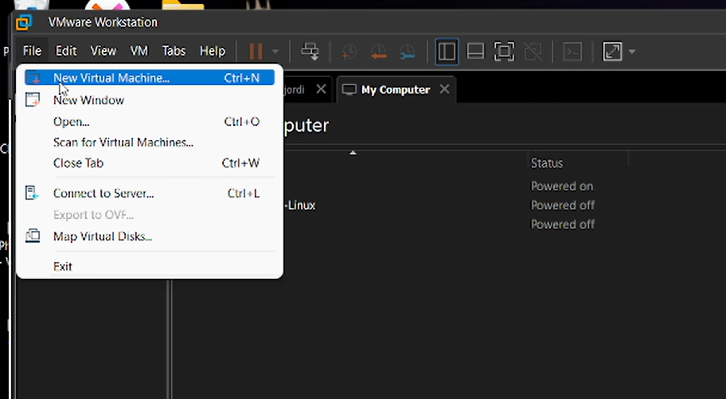{#fig:001 width=70%}

## Выбор файла образа

Для установки виртуальной машины был использован заранее скачанный образ операционной системы Fedora Linux.

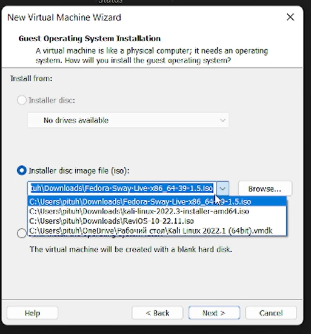{#fig:002 width=70%}

## Название и расположение виртуальной машины

Среда виртуализации предлагает по умолчанию назвать виртуальную машину из имени файла образа и расположить папку с ее файлами на диске D. Эти настройки меня устраивают, соглашаюсь и продолжаю.

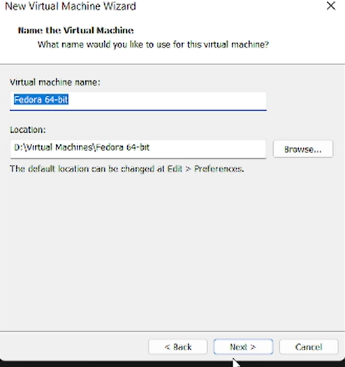{#fig:003 width=70%}

## Базовые настройки диска виртуальной машины

По умолчанию система предлагает размер диска 20 ГБ. Я не планирую использовать эту машину в дальнейшем, поэтому 20 ГБ будет достаточно. Сохранение диска в разных файлах не дает видимого преимущества в данной ситуации, сохраняю диск единым файлом. 

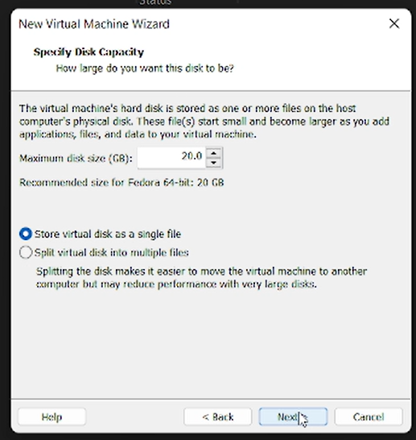{#fig:004 width=70%}

Предварительная настройка завершена, виртуальная машина создана:

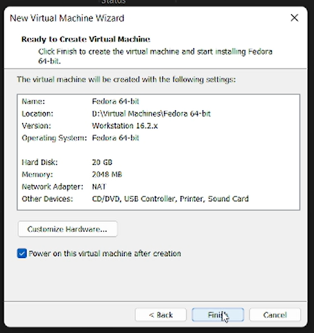{#fig:005 width=70%}

# Настройка операционной системы

## Установщик Анаконда

По умолчанию система предлагает использовать установщик Анаконда. К настройке предлагаются шесть основных параметров: раскладка клавиатуры, дата и время, место установки, имя сети и узла, учетная запись root и учетная запись пользователя. По заданию лабораторной работы необходимо настроить каждый из них.

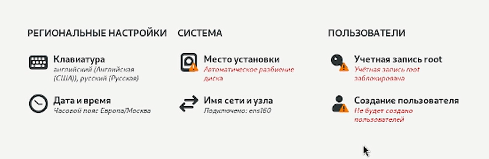{#fig:006 width=70%}

Дата и время установщиком определены верно, раскладки клавиатуры достаточные - эти параметры оставляем по умолчанию.

## Место установки

По заданию лабораторной работы место установки остается без изменений. Проверим, что предлагается системой: появившийся при создании виртуальной машины виртуальный диск разбером 20 ГБ, автоматическая конфигурация устройств хранения, без шифрования. Эти параметры достаточны, переходим к следующему шагу.

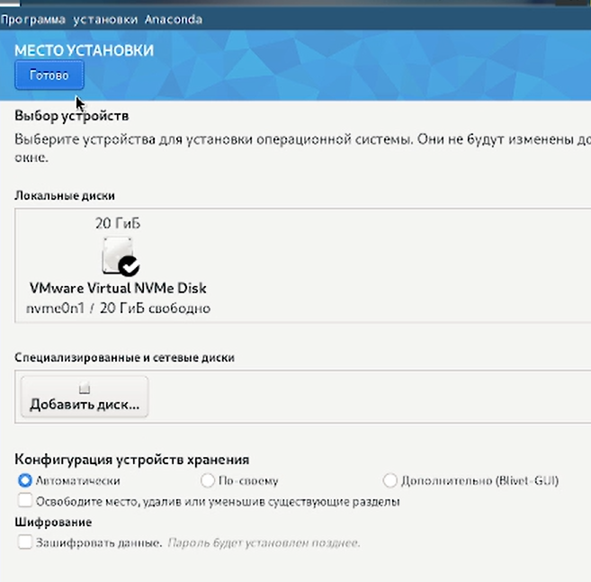{#fig:007 width=70%}

## Сеть и имя узла

По умолчанию система предлагает имя узла localhost-live. Заменяем его на имя пользователя, которого создадим в дальнейшем, других параметров здесь нет.

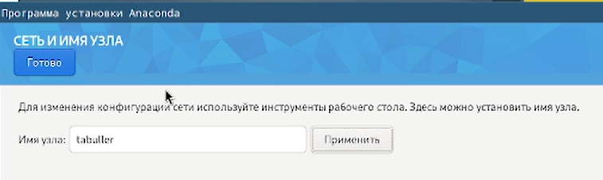{#fig:008 width=70%}

## Аккаунт администратора

По умолчанию пользователь root отсутствует. Включаем, задаем пароль, вход администратором через SSH запрещаем - настройка учетной записи администратора завершена. 

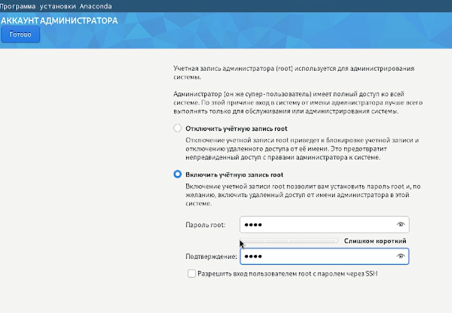{#fig:009 width=70%}

## Аккаунт пользователя

В графе полного имени ввожу свое имя, система автоматически предлагает имя пользователя. Редактирую его так, чтобы оно совпадало с именем пользователя в ДК, создаю пароль, оставляю пользователя с привилегиями администратора и требую пароль при входе. Дополнительные настройки оставляю по умолчанию, на чем завершаю настройку учетной записи

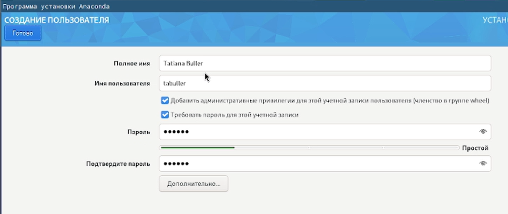{#fig:010 width=70%}

## Завершение установки

После завершения установки открываю систему. Оба пользователя работают, имя узла отображается, раскладки клавиатуры установлены корректно, время и дата отображаются верно. работа по установке виртуальной машины завершена.

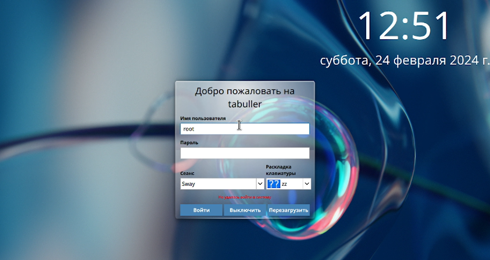{#fig:011 width=70%}

# Выводы

Приобретены  практические навыки установки операционной системы на виртуальную машину, настройки минимально необходимых для дальнейшей работы сервисов.
