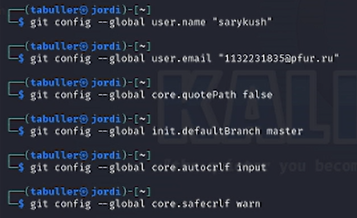
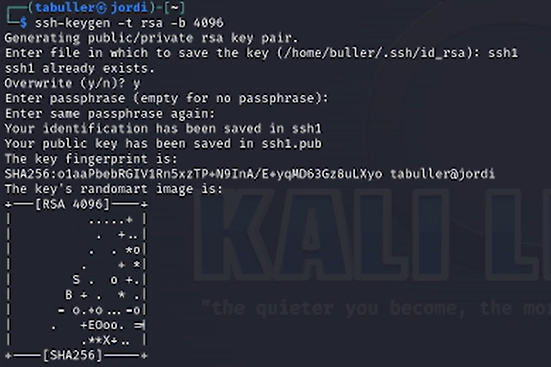
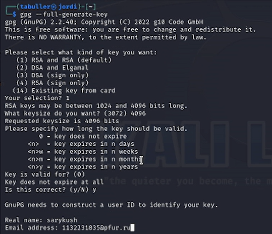
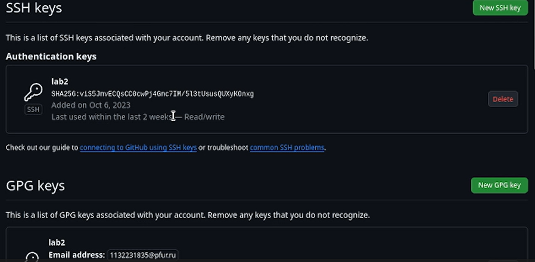
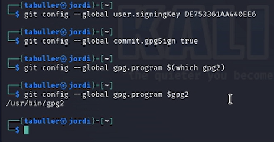
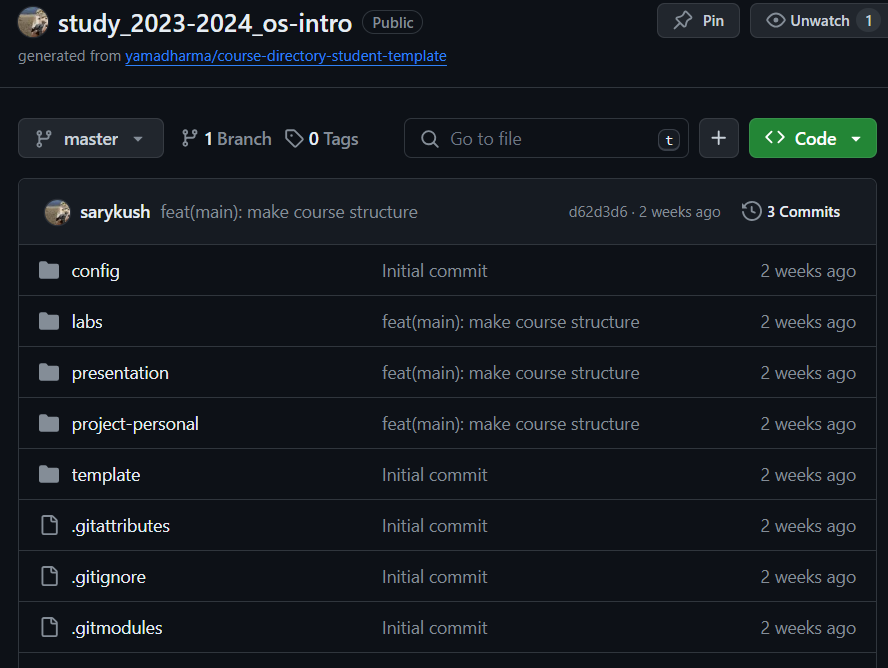

---
## Front matter
lang: ru-RU
title: Лабораторная работа №2
subtitle: Первоначальна настройка git
author:
  - Буллер Т. А.
institute:
  - Российский университет дружбы народов, Москва, Россия
date: 24 февраля 2024

## Formatting pdf
toc: false
toc-title: Содержание
slide_level: 2
aspectratio: 169
section-titles: true
theme: metropolis
header-includes:
 - \metroset{progressbar=frametitle,sectionpage=progressbar,numbering=fraction}
 - '\makeatletter'
 - '\beamer@ignorenonframefalse'
 - '\makeatother'
## I18n polyglossia
polyglossia-lang:
  name: russian
  options:
        - spelling=modern
        - babelshorthands=true
polyglossia-otherlangs:
  name: english
## I18n babel
babel-lang: russian
babel-otherlangs: english
## Fonts
mainfont: PT Serif
romanfont: PT Serif
sansfont: PT Sans
monofont: PT Mono
mainfontoptions: Ligatures=TeX
romanfontoptions: Ligatures=TeX
sansfontoptions: Ligatures=TeX,Scale=MatchLowercase
monofontoptions: Scale=MatchLowercase,Scale=0.9

---

# Информация

## Докладчик

:::::::::::::: {.columns align=center}
::: {.column width="70%"}

  * Буллер Татьяна Александровна
  * студент группы  НБИбд-01-23
  * Российский университет дружбы народов

:::
::: {.column width="30%"}

:::
::::::::::::::
# Вводная часть

## Объект и предмет исследования

- Система контроля версий git
- Основные команды git
- Методы работы с локальным репозиторием

## Цели и задачи

- Изучить идеологию и применение средств контроля версий.
- Освоить умения по работе с git.

## Материалы и методы

- Система контроля версий git
- Виртуальная машина Linux
- `ssh-keygen` и `gpg` для создания ключей
- Процессор `pandoc` для входного формата Markdown
- Результирующие форматы
	- `pdf`
	- `html`
- Автоматизация процесса создания: `Makefile`

# Выполнение лабораторной работы

## Создание базовой конфигурации для работы с git

Для создания базовой конфигурации зададим имя пользователя и email
(user.name, user.email); настроим utf-8 (core.quotepath); зададим имя начальной
ветки (init.defaultBranch) и параметры autocrlf и savecrlf.

{#fig:001 width=70%}

## Создание ключа SSH.

Для создания ключа использовалась команда ssh-keygen, был создан ключ по алгоритму rsa с ключем размером 4096 бит.

{#fig:002 width=70%}

Были созданы 2 файла: приватный ключ (ssh1) и публичный (ssh1.pub), сохраненные в директории по умолчанию (../.ssh/id_rsa)

## Создать ключ PGP.

Для создания ключа использовалась команда gpg, был создан ключ типа RSA и RSA, размер - 4096, срок годности не ограничен (0).

{#fig:003 width=70%}

Оба ключа созданы. Следующий шаг - добавление их на github - работа в браузере.

## Добавление ключей на github

{#fig:004 width=70%}

В заранее созданный профиль на github были добавлены оба ключа, созданные ранее по ходу лабораторной работы.

## Настроить подписи git.

С использованием введенного email были настроены параметры user.signingkey, commit.gpgsign и gpg.program.

{#fig:005 width=70%}

При настройке подписей ошибок не возникло, параметр gpg.program оставлен в значении по умолчанию.

## Создать локальный каталог для выполнения заданий по предмету.

В заранее созданный профиль на github перед выполнением лабораторной работы был добавлен шаблон репозитория для курса "Операционные системы". Репозиторий и является локальным каталогом для выполнения заданий.

{#fig:006 width=70%}

# Выводы

Изучена идеология и применение средств контроля версий. Освоены умения по работе с git.
Создан локальный каталог для выполнения заданий по предмету, произведена базовая настройка git.
