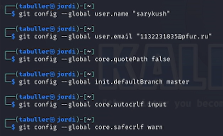
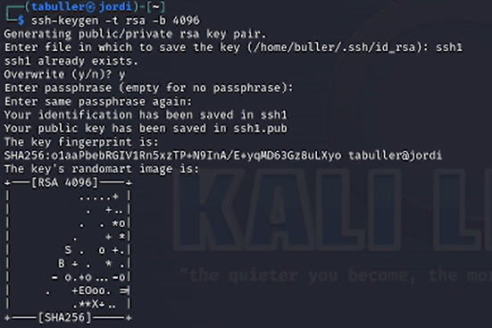
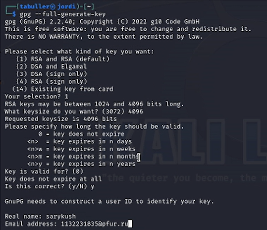
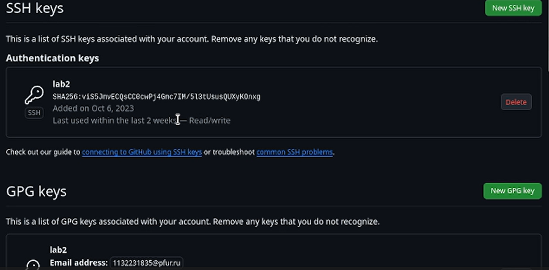
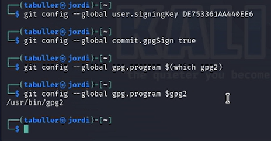
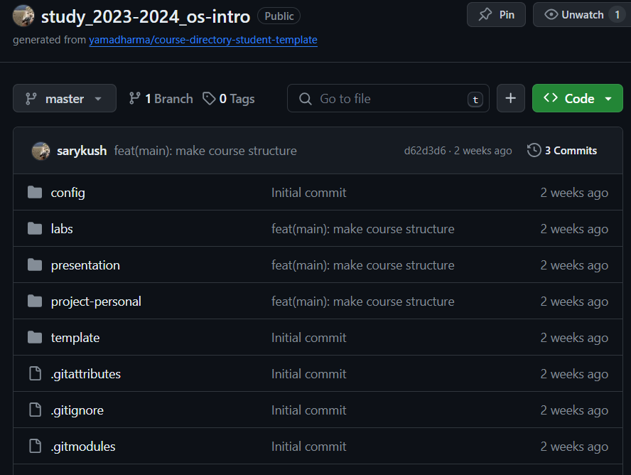

---
## Front matter
title: "Лабораторная работа №2"
subtitle: "Первоначальна настройка git"
author: "Буллер Татьяна Александровна"

## Generic otions
lang: ru-RU
toc-title: "Содержание"

## Bibliography
bibliography: bib/cite.bib
csl: pandoc/csl/gost-r-7-0-5-2008-numeric.csl

## Pdf output format
toc: true # Table of contents
toc-depth: 2
lof: true # List of figures
lot: false # List of tables
fontsize: 12pt
linestretch: 1.5
papersize: a4
documentclass: scrreprt
## I18n polyglossia
polyglossia-lang:
  name: russian
  options:
	- spelling=modern
	- babelshorthands=true
polyglossia-otherlangs:
  name: english
## I18n babel
babel-lang: russian
babel-otherlangs: english
## Fonts
mainfont: PT Serif
romanfont: PT Serif
sansfont: PT Sans
monofont: PT Mono
mainfontoptions: Ligatures=TeX
romanfontoptions: Ligatures=TeX
sansfontoptions: Ligatures=TeX,Scale=MatchLowercase
monofontoptions: Scale=MatchLowercase,Scale=0.9
## Biblatex
biblatex: true
biblio-style: "gost-numeric"
biblatexoptions:
  - parentracker=true
  - backend=biber
  - hyperref=auto
  - language=auto
  - autolang=other*
  - citestyle=gost-numeric
## Pandoc-crossref LaTeX customization
figureTitle: "Рис."
tableTitle: "Таблица"
listingTitle: "Листинг"
lofTitle: "Список иллюстраций"
lotTitle: "Список таблиц"
lolTitle: "Листинги"
## Misc options
indent: true
header-includes:
  - \usepackage{indentfirst}
  - \usepackage{float} # keep figures where there are in the text
  - \floatplacement{figure}{H} # keep figures where there are in the text
---

# Цель работы

Изучить идеологию и применение средств контроля версий, освоить умения по работе с git.

# Задание

- Создать базовую конфигурацию для работы с git.
- Создать ключ SSH.
- Создать ключ PGP.
- Настроить подписи git.
- Зарегистрироваться на Github.
- Создать локальный каталог для выполнения заданий по предмету.

# Выполнение лабораторной работы

## Создать базовую конфигурацию для работы с git.

Для создания базовой конфигурации зададим имя пользователя и email (user.name, user.email); настроим utf-8 (core.quotepath); зададим имя начальной ветки (init.defaultBranch) и параметры autocrlf и savecrlf.

{#fig:001 width=70%}

Ошибок при задании параметров не возникло, данные заданы успешно.

## Создать ключ SSH.

Для создания ключа использовалась команда ssh-keygen, был создан ключ по алгоритму rsa с ключем размером 4096 бит.

{#fig:002 width=70%}

Были созданы 2 файла: приватный ключ (ssh1) и публичный (ssh1.pub), сохраненные в директории по умолчанию (../.ssh/id_rsa)

## Создать ключ PGP.

Для создания ключа использовалась команда gpg, был создан ключ типа RSA и RSA, размер - 4096, срок годности не ограничен (0).

{#fig:003 width=70%}

Оба ключа созданы. Следующий шаг - добавление их на github - работа в браузере.

{#fig:004 width=70%}

На данном этапе работы ошибок не возникло, ключи загружены успешно.

## Настроить подписи git.

С использованием введенного email были настроены параметры user.signingkey, commit.gpgsign и gpg.program.

{#fig:005 width=70%}

При настройке подписей ошибок не возникло, параметр gpg.program оставлен в значении по умолчанию.

## Создать локальный каталог для выполнения заданий по предмету.

В заранее созданный профиль на github перед выполнением лабораторной работы был добавлен шаблон репозитория для курса "Операционные системы". Он и является локальным каталогом курса.

{#fig:006 width=70%}

# Выводы

Изучена идеология и применение средств контроля версий. Освоены умения по работе с git.
Создан локальный каталог для выполнения заданий по предмету, произведена базовая настройка git.
