---
## Front matter
lang: ru-RU
title: Лабораторная работа №4
subtitle: Продвинутое использование git
author:
  - Буллер Т. А.
institute:
  - Российский университет дружбы народов, Москва, Россия
date: 8 марта 2024

## Formatting pdf
toc: false
toc-title: Содержание
slide_level: 2
aspectratio: 169
section-titles: true
theme: metropolis
header-includes:
 - \metroset{progressbar=frametitle,sectionpage=progressbar,numbering=fraction}
 - '\makeatletter'
 - '\beamer@ignorenonframefalse'
 - '\makeatother'
## I18n polyglossia
polyglossia-lang:
  name: russian
  options:
        - spelling=modern
        - babelshorthands=true
polyglossia-otherlangs:
  name: english
## I18n babel
babel-lang: russian
babel-otherlangs: english
## Fonts
mainfont: PT Serif
romanfont: PT Serif
sansfont: PT Sans
monofont: PT Mono
mainfontoptions: Ligatures=TeX
romanfontoptions: Ligatures=TeX
sansfontoptions: Ligatures=TeX,Scale=MatchLowercase
monofontoptions: Scale=MatchLowercase,Scale=0.9

---

# Информация

## Докладчик

:::::::::::::: {.columns align=center}
::: {.column width="70%"}

  * Буллер Татьяна Александровна
  * студент группы  НБИбд-01-23
  * Российский университет дружбы народов

:::
::: {.column width="30%"}

:::
::::::::::::::
# Вводная часть

## Объект и предмет исследования

- Система контроля версий git
- Менеджер пакетов pnpm
- Методы создания шаблонных коммитов и версий релизов

## Цели и задачи

- Получение навыков правильной работы с репозиториями git.

## Материалы и методы

- Система контроля версий git
- Менеджер пакетов `pnpm`
- Программы `commitizen` и`standard-changelog` для создания шаблонных коммитов
- Процессор `pandoc` для входного формата Markdown
- Результирующие форматы
	- `pdf`
	- `html`
- Автоматизация процесса создания: `Makefile`

# Выполнение лабораторной работы

## Добавление общепринятых коммитов.

С помощью утилиты pnpm добавляем две программы: standard changelog и commitizen.

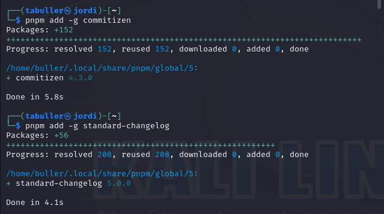{#fig:001 width=30%}

Программы добавлены. В дальнейшем они будут использоваться для добавления коммитов и создания лога изменений.

## Создание первого коммита в репозитории.

Репозиторий создаем через сайт github, после чего добавляем его на виртуальную машину. Для первого коммита создадим README-файл и добавим его:

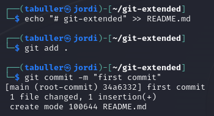{#fig:002 width=50%}

## Создание первого коммита в репозитории.

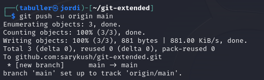{#fig:003 width=50%}

Файл отправлен с первым коммитом, работу можно продолжать дальше.

## Конфигурация общепринятых коммитов.

Введем команду pnpm init. Вывод команды демонстрирует содержание файла и его место в системе.
 
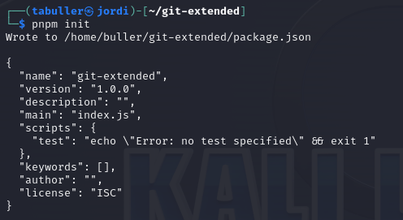{#fig:004 width=50%}

## Конфигурация общепринятых коммитов.

Откроем файл, адрес которого видим в выводе команды, и отредактируем его так, как указано в задании лабораторной работы:

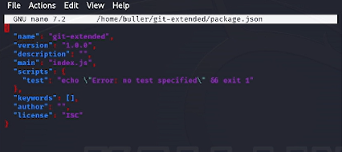{#fig:005 width=50%}

## Конфигурация общепринятых коммитов.

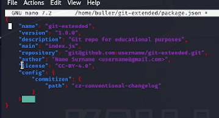{#fig:006 width=50%}

## Конфигурация общепринятых коммитов.

После редактирования файла необходимо добавить файлы в репозиторий и выполнить коммит с помощью установленного ранее скрипта.

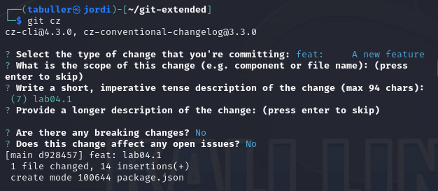{#fig:007 width=40%}

Коммит успешно настроен и отправлен. 

## Конфигурация git-flow.

Инициализируем git-flow и проверим, что мы находимся на нужной ветке (develop):

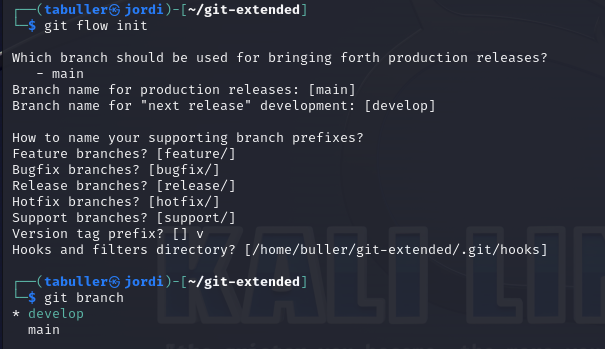{#fig:008 width=40%}

## Конфигурация git-flow.

Названия веток оставляем по умолчанию, для версий добавляем перфикс v: каждая новая версия будет выглядеть как vNN.NN.NN.
Отправляем изменения на гитхаб. Следующее, что нужно сделать - установить внешнюю ветку как вышестоящую для этой ветки.

{#fig:009 width=60%}

## Конфигурация git-flow.

После того, как работа с ветками закончена, создаем новый релиз: 1.0.0

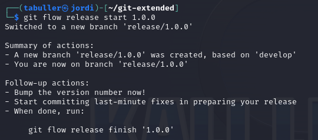{#fig:010 width=50%}

## Конфигурация git-flow.

Далее настраиваем релиз: создаем журнал изменений, добавляем его в индекс и заливаем резиз в основную ветку.

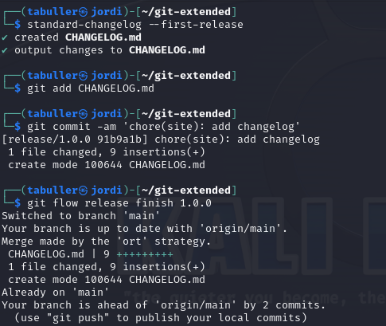{#fig:011 width=40%}

## Конфигурация git-flow.

После дого, как отправили данные, создаем релиз на гитхаб и получаем ссылку на него:

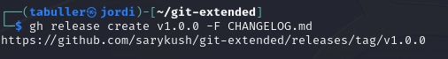{#fig:012 width=60%}

## Разработка новой функциональности.

Создадим ветку для новой функциональности:

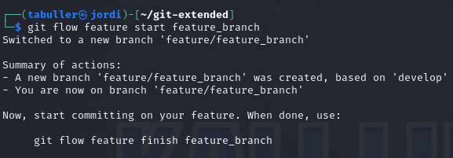{#fig:013 width=70%}

## Разработка новой функциональности.

Далее работа с гит продолжается как обычно. Для тестового репозитория никакую новую функциональность разрабатывать не будем, переходим сразу к следующему шагу:

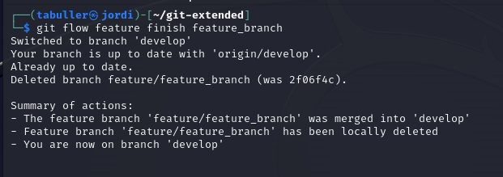{#fig:014 width=70%}

Созданная нами ветка объединилась с веткой develop.

## Создание релиза.

Создадим релиз с версией 1.2.3 и оказываемся на ветке release/1.2.3:

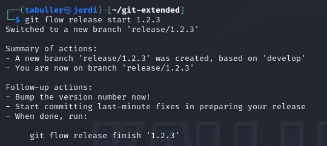{#fig:015 width=70%}

## Создание релиза.

В файле package.json обновляем номер версии. Этот файл находится прямо в репозитории, в котором мы работаем, и копирует в себе данные, которые мы настроили на первых этапах: 

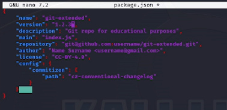{#fig:016 width=70%}

## Создание релиза.

Когда редактирование завершено, обновляем журнал изменений и добавляем его на гитхаб:

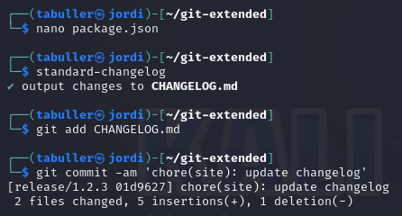{#fig:017 width=70%}

## Создание релиза.

Заливаем релиз в основную ветку, после чего отправляем данные на гитхаб:

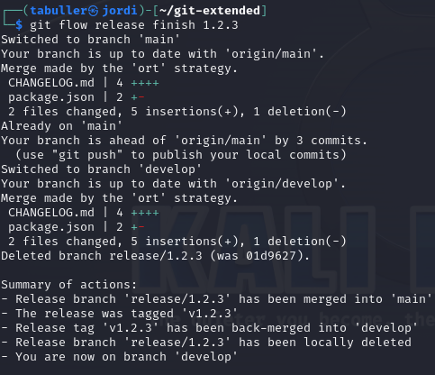{#fig:018 width=50%}

## Создание релиза.

Последним шагом закроем релиз и создадим на гитхаб новую версию - 1.2.3:

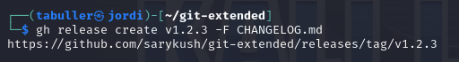{#fig:019 width=70%}

## Создание релиза.

Проверим журнал изменений в репозитории на сайте гитхаб - видим обе версии, следовательно, работа выполнена успешно.

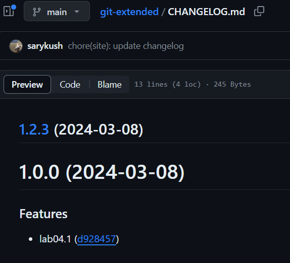{#fig:020 width=50%}

# Выводы

Получены навыки правильной работы с репозиториями git, выполнена работа для тестового репозитория и дальнейшие преобразования для основного репозитория курса.
