---
## Front matter
title: "Лабораторная работа №5"
subtitle: "Настройка рабочей среды"
author: "Буллер Татьяна Александровна"

## Generic otions
lang: ru-RU
toc-title: "Содержание"

## Bibliography
bibliography: bib/cite.bib
csl: pandoc/csl/gost-r-7-0-5-2008-numeric.csl

## Pdf output format
toc: true # Table of contents
toc-depth: 2
lof: true # List of figures
lot: false # List of tables
fontsize: 12pt
linestretch: 1.5
papersize: a4
documentclass: scrreprt
## I18n polyglossia
polyglossia-lang:
  name: russian
  options:
	- spelling=modern
	- babelshorthands=true
polyglossia-otherlangs:
  name: english
## I18n babel
babel-lang: russian
babel-otherlangs: english
## Fonts
mainfont: PT Serif
romanfont: PT Serif
sansfont: PT Sans
monofont: PT Mono
mainfontoptions: Ligatures=TeX
romanfontoptions: Ligatures=TeX
sansfontoptions: Ligatures=TeX,Scale=MatchLowercase
monofontoptions: Scale=MatchLowercase,Scale=0.9
## Biblatex
biblatex: true
biblio-style: "gost-numeric"
biblatexoptions:
  - parentracker=true
  - backend=biber
  - hyperref=auto
  - language=auto
  - autolang=other*
  - citestyle=gost-numeric
## Pandoc-crossref LaTeX customization
figureTitle: "Рис."
tableTitle: "Таблица"
listingTitle: "Листинг"
lofTitle: "Список иллюстраций"
lotTitle: "Список таблиц"
lolTitle: "Листинги"
## Misc options
indent: true
header-includes:
  - \usepackage{indentfirst}
  - \usepackage{float} # keep figures where there are in the text
  - \floatplacement{figure}{H} # keep figures where there are in the text
---

# Цель работы

Получение навыков правильной работы с менеджером паролей pass и использования chezmoi для управления файлами конфигурации домашнего каталога пользователя.

# Выполнение лабораторной работы

## Установка необходимого ПО.

Необходимо установить pass и gopass, в дистрибутивах Debian используем для этого apt-get.

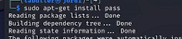{#fig:001 width=70%}

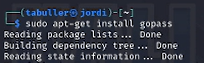{#fig:002 width=70%}

После установки менеджера паролей проверим существующие на устройстве GPG ключи:

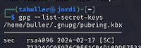{#fig:003 width=70%}

Ключи на устройстве уже есть, создавать дополнительные не нужно. Переходим к следующему шагу - инициализации хранилища.

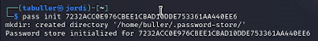{#fig:004 width=70%}

Для инициализации можем использовать почту либо ключ GPG. Инициализируем по ключу.

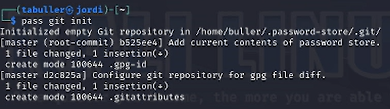{#fig:005 width=70%}

Связываем pass c git. В созданный репозиторий добавляется содержание текущего хранилища паролей.

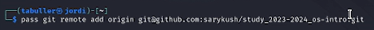{#fig:006 width=70%}

Зададим также адрес репозитория на хостинге - рабочего репозитория предмета. Далее добавляем изменения (т.к. хранилище пусто, изменений пока что нет).

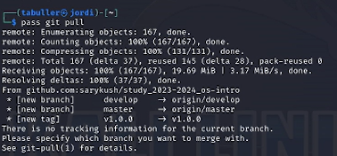{#fig:007 width=70%}

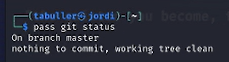{#fig:008 width=70%}

Рабочее дерево чисто, добавлять нечего - можно продолжать работу.

## Сохранение пароля

Создадим пароль. Без указания директории файл сохранится в директорию по умолчанию. Программа просит ввести пароль и повторить его:

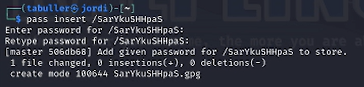{#fig:009 width=70%}

Для просмотра пароля достаточно просто использовать pass с именем файла пароля без дополнительных команд. Просматриваем пароль, затем генерируем на его месте новый случайный с помощью ```pass generate --in-place```

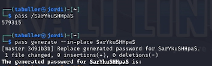{#fig:010 width=70%}

## Подключение репозитория к своей системе

Для подключения репозитория понадобится утилита chezmoi. Устанавливаем ее:

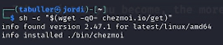{#fig:011 width=70%}

После установки необходимого ПО создаем репозиторий dotfiles из шаблона:

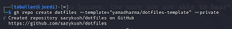{#fig:012 width=70%}

Следующим шагом необходимо провести инициализацию ранее установленной утилиты с созданным репозиторием. Используем для этого команду chezmoi init:

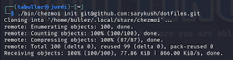{#fig:013 width=70%}

После инициализации проверяем, какие изменения предлагаются к внесению. Вывод команды довольно большой, включает в себя закомментированные строки пояснений и предлагаемые изменения.
Соглашаемся с изменениями, введя команду ```chezmoi apply -v```
Программа снова выводит список изменений, с которыми пользователь теперь уже согласился.

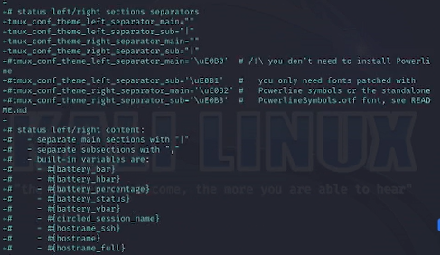{#fig:014 width=70%}

## Ежедневные операции c chezmoi

С помощью chezmoi можно извлекать изменения из репозитория одной командой и, объеденив команды, провести одновременно проверку изменений и сравнение с текущей версией. Вывод 'already up to date' говорит о том, что данные в репозитории и клоне на устройстве актуальны друг относительно друга.

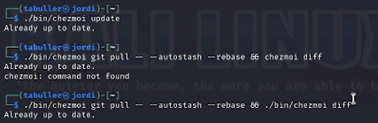{#fig:015 width=70%}

Кроме этого, есть возможность настроить автоматическую отправку коммитов. Для этого необходимо изменить файл конфигурации (по умолчанию автофиксация и отправка изменений отключены):

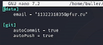{#fig:016 width=70%}

# Выводы

Получены навыки работы с менеджером паролей pass и использования chezmoi для управления файлами конфигурации домашнего каталога пользователя
