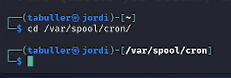

---
## Front matter
lang: ru-RU
title: Лабораторная работа №6
subtitle: Основы интерфейса взаимодействия пользователя с системой Unix на уровне командной строки
author:
  - Буллер Т. А.
institute:
  - Российский университет дружбы народов, Москва, Россия
date: 15 марта 2024

## Formatting pdf
toc: false
toc-title: Содержание
slide_level: 2
aspectratio: 169
section-titles: true
theme: metropolis
header-includes:
 - \metroset{progressbar=frametitle,sectionpage=progressbar,numbering=fraction}
 - '\makeatletter'
 - '\beamer@ignorenonframefalse'
 - '\makeatother'
## I18n polyglossia
polyglossia-lang:
  name: russian
  options:
        - spelling=modern
        - babelshorthands=true
polyglossia-otherlangs:
  name: english
## I18n babel
babel-lang: russian
babel-otherlangs: english
## Fonts
mainfont: PT Serif
romanfont: PT Serif
sansfont: PT Sans
monofont: PT Mono
mainfontoptions: Ligatures=TeX
romanfontoptions: Ligatures=TeX
sansfontoptions: Ligatures=TeX,Scale=MatchLowercase
monofontoptions: Scale=MatchLowercase,Scale=0.9

---

# Информация

## Докладчик

:::::::::::::: {.columns align=center}
::: {.column width="70%"}

  * Буллер Татьяна Александровна
  * студент группы  НБИбд-01-23
  * Российский университет дружбы народов

:::
::: {.column width="30%"}

:::
::::::::::::::
# Вводная часть

## Объект и предмет исследования

- Базовые команды терминала bash

## Цели и задачи

- Приобретение практических навыков взаимодействия пользователя с системой посредством командной строки.

## Материалы и методы

- Виртуальная машина Kali Linux
- Терминал bash
- Процессор `pandoc` для входного формата Markdown
- Результирующие форматы
	- `pdf`
	- `html`
- Автоматизация процесса создания: `Makefile`

# Выполнение лабораторной работы

## Домашний каталог

Определим имя домашнего каталога с помощью pwd. Вывод команды прост: он показывает путь до рабочей директории.

{#fig:001 width=40%}

## Домашний каталог

Далее переходим в каталог tmp. Для этого используем команду cd, указав имя каталога, куда необходимо перейти. После того, как переход выполнен, путь до каталога указывается в командной строке.

## Домашний каталог

{#fig:002 width=70%}

## Домашний каталог

Просмотрим содержимое каталога командой ls. Используем два варианта команды: "чистый" и с опцией -а. В первом случае выводятся только видимые файлы, во втором - еще и скрытые (те, названия которых начинаются с символа '.')

## Домашний каталог

{#fig:003 width=70%}

## Домашний каталог

Проверим, есть ли на устройстве каталог е /var/spool. Для этого можно использовать любую команду и проверку клавишей tab: если каталог с таким началом названий существует, то остаток названия допишется автоматически (либо, если каталогов несколько, это будет указано в терминале). Используем cd и перейдем в указанный каталог - он существует.

## Домашний каталог

{#fig:004 width=70%}

## Домашний каталог

Возвращаемся в домашний каталог с помощью команды cd. Теперь проверим, кто является владельцем файлов, расположенных в домашнем каталоге: для этого к уже известной опции -а добавим -l.

## Домашний каталог

{#fig:005 width=70%}

## Создание и удаление каталогов

С помощью mkdir создадим в домашнем каталоге каталог newdir. Той же командой внутри него создадим еще один каталог - для этого пропишем полный адрес к новому каталогу (он должен располагаться внутри newdir). Проверим с помощью ls: каталоги созданы.

## Создание и удаление каталогов

{#fig:006 width=70%}

## Создание и удаление каталогов

Далее создадим три каталога одной командой. Для того, чтобы это сделать, нужно написать названия каталогов через пробел (чтобы создать каталог с пробелом в названии, этот пробел нужно будет экранировать). Проверим с помощью ls: каталоги созданы.

## Создание и удаление каталогов

{#fig:007 width=70%}

## Создание и удаление каталогов

Для удаления этих каталогов используем команду rm (или rmdir) с опцией -r - рекурсивное удаление.

{#fig:008 width=40%}

## Создание и удаление каталогов

Той же командой попробуем удалить newdir. Без опции ничего не выйдет - этот каталог не пуст, поэтому удалить его можно только рекурсивно.

{#fig:009 width=40%}

## Руководства man

С помощью руководства к команде ls определим, какая опция нужна, чтобы вывести на экран содержимое не только целевого каталога, но и подкаталогов. Это опция -R: рекурсия. Для сортировки по времени же используется опция -t (--time).

## Руководства man

{#fig:010 width=70%}

## Руководства man

Используем команду man для просмотра описания других команд: cd, pwd, mkdir, rmdir, rm. 
К команде cd руководства нет. Эта команда используется для перемещения между каталогами.

{#fig:011 width=30%}

## Руководства man

Команда pwd используется для вывода пути к рабочей/текущей директории.

{#fig:012 width=70%}

## Руководства man

Команда mkdir используется для создания новых директорий (каталогов). Команда rmdir - для их удаления.

## Руководства man

{#fig:013 width=70%}

## Руководства man

![Руководство к rmdir]](image/14.png){#fig:014 width=70%}

## Руководства man

Команда rm используется для удаления как файлов, так и директорий.

{#fig:015 width=40%}

## Модификация команд из истории

Команда history выводит на экран последние введенные пользователем команды:

## Модификация команд из истории

{#fig:016 width=70%}

## Модификация команд из истории

Модифицируем одну из них - объединим три использованные опции команды ls в одну и посмотрим на вывод: 

## Модификация команд из истории

{#fig:017 width=70%}

# Выводы

Приобретены практические навыки взаимодействия пользователя с системой посредством командной строки.
