---
## Front matter
title: "Лабораторная работа №6"
subtitle: "Основы интерфейса взаимодействия
пользователя с системой Unix на уровне командной строки"
author: "Буллер Татьяна Александровна"

## Generic otions
lang: ru-RU
toc-title: "Содержание"

## Bibliography
bibliography: bib/cite.bib
csl: pandoc/csl/gost-r-7-0-5-2008-numeric.csl

## Pdf output format
toc: true # Table of contents
toc-depth: 2
lof: true # List of figures
lot: false # List of tables
fontsize: 12pt
linestretch: 1.5
papersize: a4
documentclass: scrreprt
## I18n polyglossia
polyglossia-lang:
  name: russian
  options:
	- spelling=modern
	- babelshorthands=true
polyglossia-otherlangs:
  name: english
## I18n babel
babel-lang: russian
babel-otherlangs: english
## Fonts
mainfont: PT Serif
romanfont: PT Serif
sansfont: PT Sans
monofont: PT Mono
mainfontoptions: Ligatures=TeX
romanfontoptions: Ligatures=TeX
sansfontoptions: Ligatures=TeX,Scale=MatchLowercase
monofontoptions: Scale=MatchLowercase,Scale=0.9
## Biblatex
biblatex: true
biblio-style: "gost-numeric"
biblatexoptions:
  - parentracker=true
  - backend=biber
  - hyperref=auto
  - language=auto
  - autolang=other*
  - citestyle=gost-numeric
## Pandoc-crossref LaTeX customization
figureTitle: "Рис."
tableTitle: "Таблица"
listingTitle: "Листинг"
lofTitle: "Список иллюстраций"
lotTitle: "Список таблиц"
lolTitle: "Листинги"
## Misc options
indent: true
header-includes:
  - \usepackage{indentfirst}
  - \usepackage{float} # keep figures where there are in the text
  - \floatplacement{figure}{H} # keep figures where there are in the text
---

# Цель работы

Приобретение практических навыков взаимодействия пользователя с системой посредством командной строки.

# Выполнение лабораторной работы

## Домашний каталог

Определим имя домашнего каталога с помощью pwd. Вывод команды прост: он показывает путь до рабочей директории.

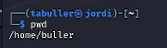{#fig:001 width=70%}

Далее переходим в каталог tmp. Для этого используем команду cd, указав имя каталога, куда необходимо перейти. После того, как переход выполнен, путь до каталога указывается в командной строке.

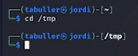{#fig:002 width=70%}

Просмотрим содержимое каталога командой ls. Используем два варианта команды: "чистый" и с опцией -а. В первом случае выводятся только видимые файлы, во втором - еще и скрытые (те, названия которых начинаются с символа '.')

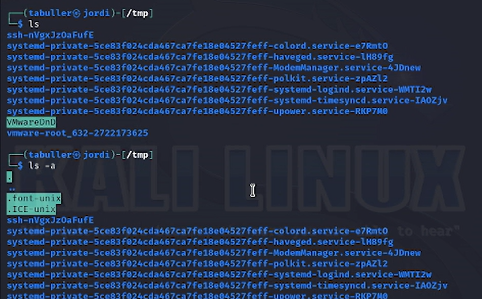{#fig:003 width=70%}

Проверим, есть ли на устройстве каталог е /var/spool. Для этого можно использовать любую команду и проверку клавишей tab: если каталог с таким началом названий существует, то остаток названия допишется автоматически (либо, если каталогов несколько, это будет указано в терминале). Используем cd и перейдем в указанный каталог - он существует.

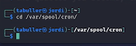{#fig:004 width=70%}

Возвращаемся в домашний каталог с помощью команды cd. Теперь проверим, кто является владельцем файлов, расположенных в домашнем каталоге: для этого к уже известной опции -а добавим -l.

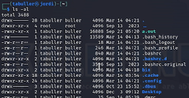{#fig:005 width=70%}

## Создание и удаление каталогов

С помощью mkdir создадим в домашнем каталоге каталог newdir. Той же командой внутри него создадим еще один каталог - для этого пропишем полный адрес к новому каталогу (он должен располагаться внутри newdir). Проверим с помощью ls: каталоги созданы.

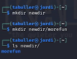{#fig:006 width=70%}

Далее создадим три каталога одной командой. Для того, чтобы это сделать, нужно написать названия каталогов через пробел (чтобы создать каталог с пробелом в названии, этот пробел нужно будет экранировать). Проверим с помощью ls: каталоги созданы.

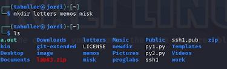{#fig:007 width=70%}

Для удаления этих каталогов используем команду rm (или rmdir) с опцией -r - рекурсивное удаление.

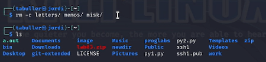{#fig:008 width=70%}

Той же командой попробуем удалить newdir. Без опции ничего не выйдет - этот каталог не пуст, поэтому удалить его можно только рекурсивно.

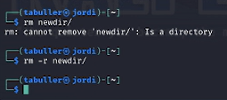{#fig:009 width=70%}

## Руководства man

С помощью руководства к команде ls определим, какая опция нужна, чтобы вывести на экран содержимое не только целевого каталога, но и подкаталогов. Это опция -R: рекурсия. Для сортировки по времени же используется опция -t (--time).

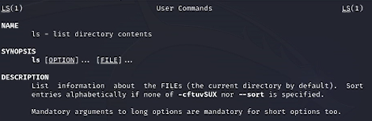{#fig:010 width=70%}

Используем команду man для просмотра описания других команд: cd, pwd, mkdir, rmdir, rm. 
К команде cd руководства нет. Эта команда используется для перемещения между каталогами.

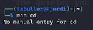{#fig:011 width=70%}

Команда pwd используется для вывода пути к рабочей/текущей директории.

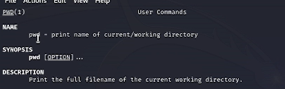{#fig:012 width=70%}

Команда mkdir используется для создания новых директорий (каталогов). Команда rmdir - для их удаления.

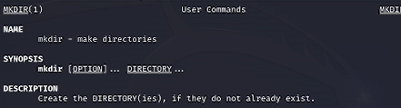{#fig:013 width=70%}

![Руководство к rmdir]](image/14.png){#fig:014 width=70%}

Команда rm используется для удаления как файлов, так и директорий.

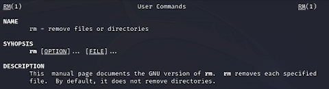{#fig:015 width=70%}

## Модификация команд из истории

Команда history выводит на экран последние введенные пользователем команды:

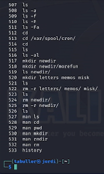{#fig:016 width=70%}

Модифицируем одну из них - объединим три использованные опции команды ls в одну и посмотрим на вывод: 

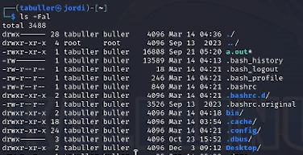{#fig:017 width=70%}

# Выводы

Приобретены практические навыки взаимодействия пользователя с системой посредством командной строки.
