---
## Front matter
lang: ru-RU
title: Лабораторная работа №7
subtitle: Анализ файловой системы Linux. Команды для работы с файлами и каталогами
author:
  - Буллер Т. А.
institute:
  - Российский университет дружбы народов, Москва, Россия
date: 23 марта 2024

## Formatting pdf
toc: false
toc-title: Содержание
slide_level: 2
aspectratio: 169
section-titles: true
theme: metropolis
header-includes:
 - \metroset{progressbar=frametitle,sectionpage=progressbar,numbering=fraction}
 - '\makeatletter'
 - '\beamer@ignorenonframefalse'
 - '\makeatother'
## I18n polyglossia
polyglossia-lang:
  name: russian
  options:
        - spelling=modern
        - babelshorthands=true
polyglossia-otherlangs:
  name: english
## I18n babel
babel-lang: russian
babel-otherlangs: english
## Fonts
mainfont: PT Serif
romanfont: PT Serif
sansfont: PT Sans
monofont: PT Mono
mainfontoptions: Ligatures=TeX
romanfontoptions: Ligatures=TeX
sansfontoptions: Ligatures=TeX,Scale=MatchLowercase
monofontoptions: Scale=MatchLowercase,Scale=0.9

---

# Информация

## Докладчик

:::::::::::::: {.columns align=center}
::: {.column width="70%"}

  * Буллер Татьяна Александровна
  * студент группы  НБИбд-01-23
  * Российский университет дружбы народов

:::
::: {.column width="30%"}


:::
::::::::::::::
# Вводная часть

## Объект и предмет исследования

- Файловая система Linux
- команды для работы с файлами и каталогами
- команды по управлению процессами (и работами)
- команды по проверке использования диска и обслуживанию файловой системы

## Цели и задачи

- Ознакомление с файловой системой Linux, её структурой, именами и содержанием каталогов. Приобретение практических навыков по применению команд для работы с файлами и каталогами, по управлению процессами (и работами), по проверке использования диска и обслуживанию файловой системы.

## Материалы и методы

- Виртуальная машина Kali Linux
- Терминал bash
- Процессор `pandoc` для входного формата Markdown
- Результирующие форматы
	- `pdf`
	- `html`
- Автоматизация процесса создания: `Makefile`

# Выполнение заданий примеров

## Копирование и создание файлов.

Необходимо скопировать файл ~/abc1 в файл april и в файл may. Для этого командой touch создаем сам файл, далее с помощью команды cp копируем его содержимое в новые файлы.

## Копирование и создание файлов.

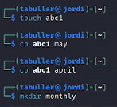{#fig:001 width=70%}

## Копирование и создание файлов.

Теперь нужно скопировать файлы april и may в каталог monthly - для этого с помощью mkdir создаем каталог monthly, с помощью уже изместной ср копируем файлы в каталог. Припишем названия файлов в одну строку - так они скопируются в рамках одной команды.

## Копирование и создание файлов.

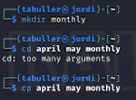{#fig:002 width=70%}

## Копирование и создание файлов.

После этого скопируем файл monthly/may в файл с именем junе - для этого используем команду ср и прописываем полный путь до файла.

## Копирование и создание файлов.

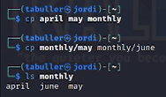{#fig:003 width=70%}

## Копирование и создание файлов.

Теперь скопируем каталог monthly в каталог monthly.00: для этого используем cp -r. Опция копируем рекурсивно - весь каталог перемещается в созданный новый.

## Копирование и создание файлов.

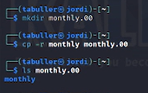{#fig:004 width=70%}

## Копирование и создание файлов.

Далее по заданию нужно скопировать каталог monthly.00 в каталог /tmp. Для этого опять используем опцию рекурсивного копирования и прописываем полный путь к файлу (каталогу), куда хотим копировать.

## Копирование и создание файлов.

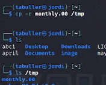{#fig:005 width=70%}

##  Перемещение и переименование файлов и каталогов

Задание: зменить название файла april на july в домашнем каталоге. Для этого используем команду mv: де-юре название будет изменено, де-факто мы перемещаем файл в файл с другим названием и удаляем предыдущий одной командой.

##  Перемещение и переименование файлов и каталогов

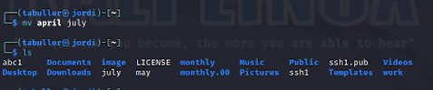{#fig:006 width=70%}

##  Перемещение и переименование файлов и каталогов

Чтобы переместить файл july в каталог monthly.00 используем ту же команду, на этот раз прописывая полный путь до места назначения. При проверке новый файл появляется вместо с остальным содержимым каталога.

##  Перемещение и переименование файлов и каталогов

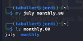{#fig:007 width=70%}

##  Перемещение и переименование файлов и каталогов

Необходимо также переименовать каталог monthly.00 в monthly.01. Для этого снова используем mv, работаем точно так же, как когда нам нужно было переименовать файл.

##  Перемещение и переименование файлов и каталогов

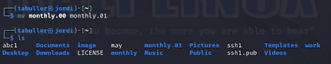{#fig:008 width=70%}

##  Перемещение и переименование файлов и каталогов

Переместить каталог monthly.01 в каталог reports. Для этого сперва создаем каталог с нужным именем, после этого перемещаем каталог, как до этого делали с файлами.
Чтобы далее переименовать каталог reports/monthly.01 в reports/monthly снова используем ту же команду, но на этот раз, так как мы переименовываем файлы не в рабочем каталоге, прописываем полный путь до них:

##  Перемещение и переименование файлов и каталогов

{#fig:009 width=70%}

## Права доступа и их изменение

В каталоге существует файл may. Дадим владельцу права на его исполнение, после чего заберем назад и посмотрим, что получилось.
После добавления права исполнения (+u) для владельца (u) при просмотре файла он подсвечивается зеленым - теперо его можно исполнять, а в строке прав появляется дополнительный символ. Когда же право изымается, файл возвращается к исходному состоянию.

## Права доступа и их изменение

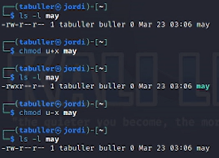{#fig:010 width=70%}

## Права доступа и их изменение

Требуется создать каталог monthly с запретом на чтение для членов группы и всех остальных пользователей. Каталог уже создан, для того, чтобы лишить пользователей прав чтения, используем chmod. -r - лишение права чтения, для группы (g) и всех пользователей (о) соответственно.

## Права доступа и их изменение

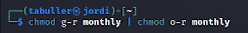{#fig:011 width=70%}

## Права доступа и их изменение

Теперь создадим новый файл и дадим группе права на запись в него. Пользуемся тем же, чем пользовались, когда добавляли владельцу права на исполнение, но теперь работаме с группой (g) и правом записи (+w)

## Права доступа и их изменение

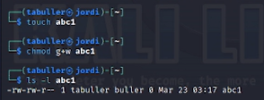{#fig:012 width=70%}

# Выполнение лабораторной работы

## Копирование и создание файлов.

Задание: скопируйте файл (...) в домашний каталог и назовите егоequipment. Если файла io.h нет, то используйте любой другой файл в каталоге /usr/include/sys/ вместо него.
Проблема: моя система не имеет каталога /usr/include/sys/ в принципе. Вместо этого копируем файл из usr/include/, проверяем его наличие - в выводе команды ls он отображается - и переходим к следующему шагу: создадим новую директорию и переместим скопированный файл в него.

## Копирование и создание файлов.

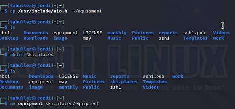{#fig:013 width=70%}

## Копирование и создание файлов.

Далее скопируем под другим названием файл abc1, для этого используем команду ср. Проверим - файлы скопировались, все на месте. Далее создаем новую директорию и переносим новые файлы туда. 

## Копирование и создание файлов.

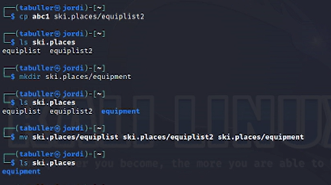{#fig:014 width=70%}

##  Перемещение и переименование файлов и каталогов

Теперь создадим в домашнем каталоге новую директорию и переместим ее (уже под другим именем) в созданный каталог ski.places - для этого используем mkdir и mv соответственно.

##  Перемещение и переименование файлов и каталогов

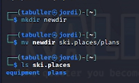{#fig:015 width=70%}

## Права доступа и их изменение

Далее определим опции, необходимые для изменение прав на файлы и директории. Что имеем по заданию:
- ```drwxr--r-- ... australia```
- ```drwx--x--x ... play```
- ```-r-xr--r-- ... my_os```
- ```-rw-rw-r-- ... feathers```

## Права доступа и их изменение

Видим, что первые два файла являются директориями, последние - отдельными файлами. Начнем с конца.
Изначально владелец файла имеет право на чтение и запись, все остальные (группа и прочие пользователи) - только на чтение. Для файлов нам необходимо:

## Права доступа и их изменение

- убрать у владельца  my_os право на запись, добавить право на исполение (u-w+x)
- добавить группе владельца файла feathers право на запись в файл (g+w)

## Права доступа и их изменение

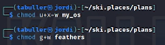{#fig:016 width=70%}

## Права доступа и их изменение

australia и play являются каталогами, о чем говорит буква d в начале строки прав доступа. По умолчанию владелец директории имеет все права к ней, группа и другие пользователи - права на чтение и исполнение.

## Права доступа и их изменение

Для первого каталога необходимо убрать у всех, кроме владельца, права на исполнение. Для этого используем go-x. Для второго каталога убираем у всех, кроме владельца, права на чтение go-w.

## Права доступа и их изменение

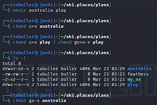{#fig:017 width=70%}

##  Перемещение и переименование файлов и каталогов

Теперь продолжим работу с файлами. Попробуем вывести на экран содержимое файла /etc/password - и столкнемся с ошибкой, потому что на данном дистрибутиве такого файла в системе нет. Его функции выполняет /etc/passwd.

##  Перемещение и переименование файлов и каталогов

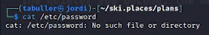{#fig:018 width=70%}

##  Перемещение и переименование файлов и каталогов

Далее скопируем уже имеющийся файл feathers под новым названием в домашнюю директорию. file.old теперь перемещаем в директорию play, копируем этот каталог в созданный в домашнем каталоге fun и уже его переносим назад в play/games

##  Перемещение и переименование файлов и каталогов

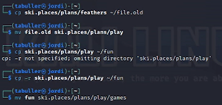{#fig:019 width=70%}

## Права доступа и их изменение

Теперь поработаем с правами доступа. 
Лишим владельца файла ~/feathers права на чтение. При просмотреть файл ~/feathers командой cat мы встречаемся с ошибкой: доступ запрещен, мы только что отобрали у себя это право. То же самое будет при попытке скопировать файл ~/feathers. Смилуемся и вернем право на чтение: u+r.

## Права доступа и их изменение

Далее лишаем владельца каталога ~/play права на выполнение. При попытке перейти в этот каталог снова видим ту же ошибку: доступ запрещен, так как я запретила владельцу (себе) исполнять этот файл (каталог). Возвращаю права на выполнение - теперь все будет работать.

## Права доступа и их изменение

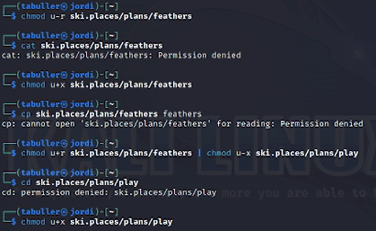{#fig:020 width=70%}

## Руководства man

После этого посмотрим на несколько руководств. Команда mount, судя по описанию, монтирует файловую систему:

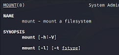{#fig:021 width=50%}

## Руководства man

Команда fsck проверяет файловую систему и репарирует ее, если были найдены ошибки.

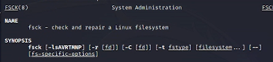{#fig:022 width=50%}

## Руководства man

Команда mkfs создает файловую систему в принципе.

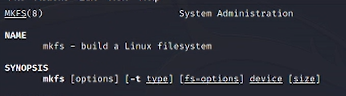{#fig:023 width=50%}

## Руководства man

Команда kill "убивает" (отключает) процессы или задачи.

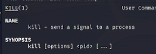{#fig:024 width=50%}

# Выводы

Приобретены практические навыки взаимодействия пользователя с системой посредством командной строки.
