---
## Front matter
lang: ru-RU
title: Лабораторная работа №8
subtitle: Поиск файлов. Перенаправление ввода-вывода. Просмотр запущенных процессов.
author:
  - Буллер Т. А.
institute:
  - Российский университет дружбы народов, Москва, Россия
date: 30 марта 2024

## Formatting pdf
toc: false
toc-title: Содержание
slide_level: 2
aspectratio: 169
section-titles: true
theme: metropolis
header-includes:
 - \metroset{progressbar=frametitle,sectionpage=progressbar,numbering=fraction}
 - '\makeatletter'
 - '\beamer@ignorenonframefalse'
 - '\makeatother'
## I18n polyglossia
polyglossia-lang:
  name: russian
  options:
        - spelling=modern
        - babelshorthands=true
polyglossia-otherlangs:
  name: english
## I18n babel
babel-lang: russian
babel-otherlangs: english
## Fonts
mainfont: PT Serif
romanfont: PT Serif
sansfont: PT Sans
monofont: PT Mono
mainfontoptions: Ligatures=TeX
romanfontoptions: Ligatures=TeX
sansfontoptions: Ligatures=TeX,Scale=MatchLowercase
monofontoptions: Scale=MatchLowercase,Scale=0.9

---

# Информация

## Докладчик

:::::::::::::: {.columns align=center}
::: {.column width="70%"}

  * Буллер Татьяна Александровна
  * студент группы  НБИбд-01-23
  * Российский университет дружбы народов

:::
::: {.column width="30%"}

:::
::::::::::::::
# Вводная часть

## Объект и предмет исследования

- инструменты поиска файлов
- инструменты фильтрации текстовых данных.
- команды по управлению процессами (и заданиями)
- команды по проверке использования диска и обслуживанию файловых систем

## Цели и задачи

- Ознакомление с инструментами поиска файлов и фильтрации текстовых данных. Приобретение практических навыков: по управлению процессами (и заданиями), по проверке использования диска и обслуживанию файловых систем.

## Материалы и методы

- Виртуальная машина Kali Linux
- Терминал bash
- Процессор `pandoc` для входного формата Markdown
- Результирующие форматы
	- `pdf`
	- `html`
- Автоматизация процесса создания: `Makefile`

# Выполнение лабораторной работы

## Перенаправление ввода-вывода.

Необходимо в файл file.txt названия файлов, содержащихся в каталоге /etc, и дописать в этот же файл названия файлов, содержащихся в домашнем каталоге.
Для этого используем команду  ls (просмотр файлов), но перенаправим ее вывод в нужный файл (символом > для первого перенаправлени и >> для дописывания в существующий файл).

## Перенаправление ввода-вывода.

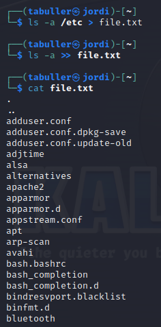{#fig:001 width=30%}

## Фильтрация вывода.

Далее переходим в каталог tmp. Для этого используем команду cd, указав имя каталога, куда необходимо перейти. После того, как переход выполнен, путь до каталога указывается в командной строке.

## Фильтрация вывода.

Следующим шагов выведем имена всех файлов из file.txt, имеющих расширение .conf, после чего запишем их в новый текстовой файл conf.txt.
Для фильтрации вывода используем команду grep с регулярным выражением: для того, чтобы точка отображалась именно как символ точки, а не один любой символ, дважды экранируем ее обратным слэшем ('\\'), а чтобы после расширения файла не стояло ни единого символа (например, чтобы вместо .conf не выводилось .config), укажем символ $.

## Фильтрация вывода.

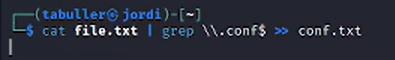{#fig:002 width=70%}

## Фильтрация вывода.

Проверим вывод файла, используя то же регулярное выражение для grep: это поможет подсветить нужные элементы в выводе. Как видим, запись прошла без ошибок.

## Фильтрация вывода.

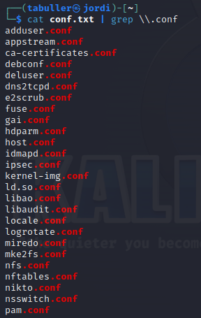{#fig:003 width=30%}

## Фильтрация вывода.

Далее по заданию нужно предложить несколько вариантов, как определить, какие файлы в домашнем каталоге имеют имена, начинавшиеся с символа c. Для этого используем тот же grep, на этот раз с други выражение. Самые простые варианты - указать только на начало строки (^ - начало, ^с  - указание на то, что в начале обязательно стоит символ с) либо на то, что после первого символа с стоит любой другой (с*).

## Фильтрация вывода.

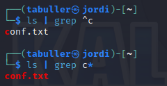{#fig:004 width=60%}

## Фильтрация вывода.

То же самое сделаем для всех файлов, начинающихся с h в каталоге /etc и проверим вывод постранично, используя команду more (файлов и так немного, поэтому постраничный вывод от обычного не отличается):

## Фильтрация вывода.

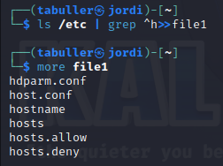{#fig:005 width=50%}

##  Перевод процессов в фон и терминирование задач

Задание: запустить в фоновом режиме процесс, который будет записывать в файл ~/logfile файлы, имена которых начинаются с log.
Для этого используем команду find. В параметре -name укажем "log*" и попросим распечатать в logfile. Для того, чтобы перевести процесс в фоновый режим, укажем символ амперсанта - как только процесс выполнится, терминал об этом сообщит, а до этого можно выполнять другие задачи.

##  Перевод процессов в фон и терминирование задач

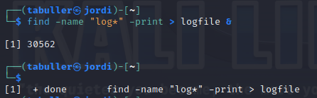{#fig:006 width=60%}

##  Перевод процессов в фон и терминирование задач

Проверим, что нашла команда, используя grep для подсветки начала названия (log). Можно видеть, что все файлы, начинающиеся с сочетания букв log, были записаны в logfile.

##  Перевод процессов в фон и терминирование задач

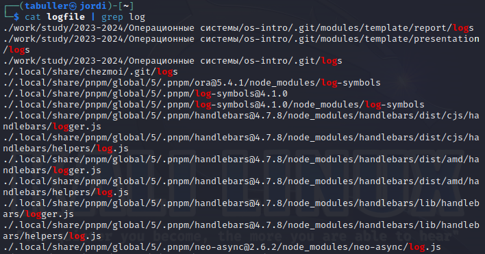{#fig:007 width=30%}

##  Перевод процессов в фон и терминирование задач

Далее переведем в фон процесс gedit. Используем символ амперсанта и видим, как процесс (в квадратных скобках указан номер задачи, за ним - pid процесса) запущен в фоновом режиме.

##  Перевод процессов в фон и терминирование задач

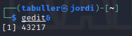{#fig:008 width=70%}

##  Перевод процессов в фон и терминирование задач

Определим идентификатор процесса gedit, используя команду ps, конвейер и фильтр grep. Получаем две строки: сам gedit (который на самом деле не установлен, поэтому в выводе видим процесс сообщения об отсутствующей команде) и grep, который ищет этот gedit. Нужный нам процесс - первый.

##  Перевод процессов в фон и терминирование задач

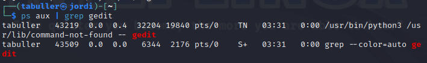{#fig:009 width=60%}

##  Перевод процессов в фон и терминирование задач

Теперь необходимо от этого процесса избавиться. Сделать это можно двумя способами: по номеру задачи либо по идентификатору процесса. Для того, чтобы убить процесс по идентификатору, используем опцию -9 с самим идентификатором процесса. Для убийства по задаче используем символ % с номером задачи.

##  Перевод процессов в фон и терминирование задач

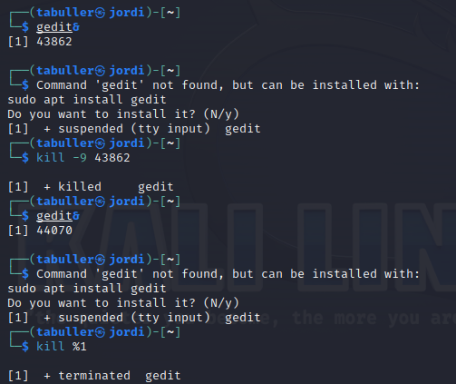{#fig:010 width=30%}

##  Проверка использования диска

Для работы с диском рассмотрим две команды du и df. Первая говорит нам о том, что и как диск занимает непосредственно. Вторая - о том, насколько диск заполнен.

##  Проверка использования диска

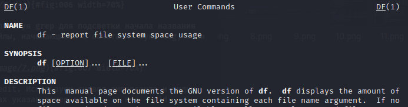{#fig:011 width=50%}

##  Проверка использования диска

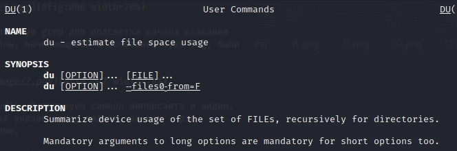{#fig:012 width=50%}

##  Проверка использования диска

Попробуем исполнить эти команды и видим, соответственно, сколько места использовано и осталось на дисках (df) и то, сколько какой файл занимает (du).

##  Проверка использования диска

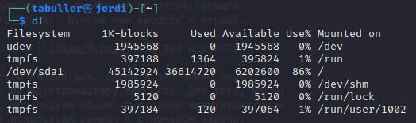{#fig:013 width=40%}

##  Проверка использования диска

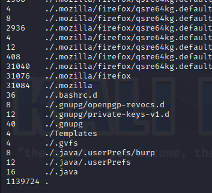{#fig:014 width=30%}

##  Поиск в домашнем каталоге

Последним шагом с помощью команды find выведем имена всех файлов, имеющихся в домашнем каталоге. Для этого укажем несколько параметров: во-первых то, что ищем мы в домашнем каталоге и только в нем (глубина поиска 0), во-вторых - то, что ищем мы директории.

##  Поиск в домашнем каталоге

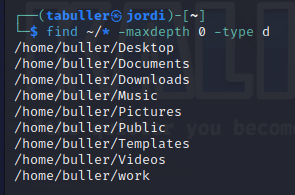{#fig:015 width=40%}

# Выводы

Приобретены практические навыки по работе с инструментами поиска файлов и фильтрации текстовых данных, по управлению процессами (и заданиями), по проверке использования диска и обслуживанию файловых систем.
