---
## Front matter
lang: ru-RU
title: Лабораторная работа №8
subtitle: Командная оболочка Midnight Commander
author:
  - Буллер Т. А.
institute:
  - Российский университет дружбы народов, Москва, Россия
date: 05 апреля 2024

## Formatting pdf
toc: false
toc-title: Содержание
slide_level: 2
aspectratio: 169
section-titles: true
theme: metropolis
header-includes:
 - \metroset{progressbar=frametitle,sectionpage=progressbar,numbering=fraction}
 - '\makeatletter'
 - '\beamer@ignorenonframefalse'
 - '\makeatother'
## I18n polyglossia
polyglossia-lang:
  name: russian
  options:
        - spelling=modern
        - babelshorthands=true
polyglossia-otherlangs:
  name: english
## I18n babel
babel-lang: russian
babel-otherlangs: english
## Fonts
mainfont: PT Serif
romanfont: PT Serif
sansfont: PT Sans
monofont: PT Mono
mainfontoptions: Ligatures=TeX
romanfontoptions: Ligatures=TeX
sansfontoptions: Ligatures=TeX,Scale=MatchLowercase
monofontoptions: Scale=MatchLowercase,Scale=0.9

---

# Информация

## Докладчик

:::::::::::::: {.columns align=center}
::: {.column width="70%"}

  * Буллер Татьяна Александровна
  * студент группы  НБИбд-01-23
  * Российский университет дружбы народов

:::
::: {.column width="30%"}

:::
::::::::::::::
# Вводная часть

## Объект и предмет исследования

- командная оболочка Midnight Commander
- текстовый редактор nano

## Цели и задачи

- Освоение основных возможностей командной оболочки Midnight Commander. Приобретение навыков практической работы по просмотру каталогов и файлов; манипуляций с ними.

## Материалы и методы

- Виртуальная машина Kali Linux
- командная оболочка Midnight Commander
- текстовый редактор nano
- Процессор `pandoc` для входного формата Markdown
- Результирующие форматы
	- `pdf`
	- `html`
- Автоматизация процесса создания: `Makefile`

# Выполнение лабораторной работы

## Встроенный редактор mc.

Откроем редактор с помощью соответсвующей команды. Видим, что окно разделено на две части (в начале работы на обеих открыта домашняя директория), внизу имеется строка для ввода команд либо выбора встроенных команд-кнопок.

## Встроенный редактор mc.

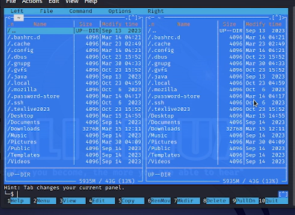{#fig:001 width=70%}

## Встроенный редактор mc.

Меню пользователя открывается одной из кнопок снизу и содержит несколько команд для работы как с самим редактором, так и с файлами в нем.

## Встроенный редактор mc.

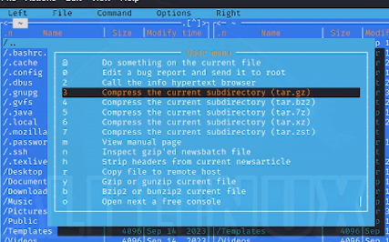{#fig:002 width=70%}

## Встроенный редактор mc.

Для открытия файла в режиме просмотра используем клавишу F3. Файл открывается во встроенном редакторе и не доступен для редактирования в данном режиме.

## Встроенный редактор mc.

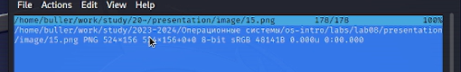{#fig:003 width=70%}

## Встроенный редактор mc.

С помощью mc можно удобно копировать и перемещать файлы между директориями. В случае, если в разных окнах открыты разные директории, при попытке скопировать/переместить файл из одного окна будет автоматически предлагаться директория, открытая в другом окне.

## Встроенный редактор mc.

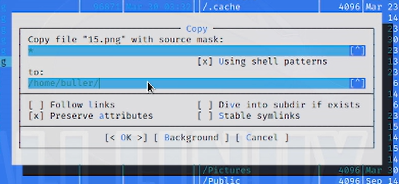{#fig:004 width=70%}

## Встроенный редактор mc.

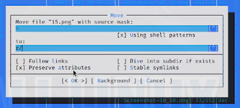{#fig:005 width=70%}

## Встроенный редактор mc.

Можем проверять вывод некоторых команд для файлов, не вводя их непосредственно в командной строке: например, для того, чтобы проверить разрешения файла, нужно нажать отдельно комбинацию клавиш Ctrl+X, а затем C.

## Встроенный редактор mc.

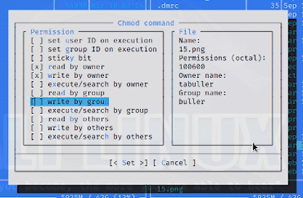{#fig:006 width=70%}

## Встроенный редактор mc.

В самом редакторе возможно отображение информации о файле вместо второго окна директории. В информацию, отображаемую в таком выводе, входит дата последнего изменения, размер, разрешения файла и т.п.

## Встроенный редактор mc.

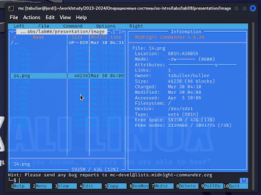{#fig:007 width=70%}

## Встроенный редактор mc.

Работа с файлами осуществляется посредством горячих клавиш либо меню. Например, для открытия файла в режиме просмотра необходимо нажать F3, для редактирования файла - F4. В первом случае файл откроется в самом mc, во втором - в тектовом редакторе, выбранном при настройке шелла.

## Встроенный редактор mc.

Кроме того, с помощью того же раздела менб можно создавать директории внутри выбранной директории.

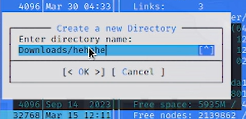{#fig:008 width=70%}

## Встроенный редактор mc.

Шелл предусматривает также функцию поиска и фильтрации (grep+find). Для примера попробуем начать поиск с домашней директории и найти файлы, название которых начинается на ssh1 - таких два, сам ssh1 и ssh1.pub. 

## Встроенный редактор mc.

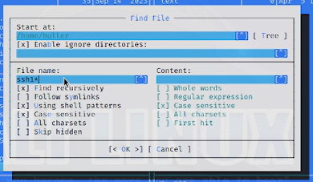{#fig:009 width=70%}

## Встроенный редактор mc.

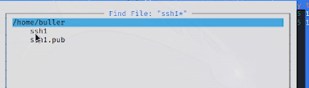{#fig:010 width=70%}

## Встроенный редактор mc.

Все команды, введенные внутри шелла, сохраняются в истории. Окно истории можно открыть и воспроизвести одну из недавних команд заново, не переписывая ее вручную:

## Встроенный редактор mc.

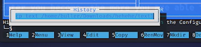{#fig:011 width=70%}

## Встроенный редактор mc.

С помощью подменю команда можем открыть дерево директорий для более удобной навигации по ним. Перейдем с помощью этого из корневой директории в домашнюю:

## Встроенный редактор mc.

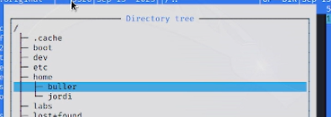{#fig:012 width=70%}

## Встроенный редактор mc.

В том же подменю может открыть (и отредактировать) конфигурационные файлы: файлы меню (самого редактора или меню пользователя) и файл расширений.

## Встроенный редактор mc.

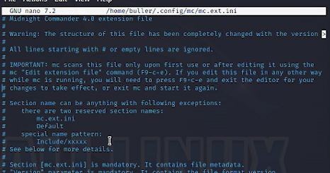{#fig:013 width=70%}

## Встроенный редактор mc.

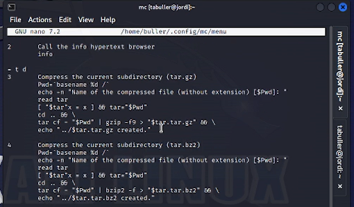{#fig:014 width=70%}

## Встроенный редактор mc.

Редактор настраиваем: можно изменять внешний вид, редактировать отображение файлов, ширину окна и прочие элементы структуры экрана.

## Встроенный редактор mc.

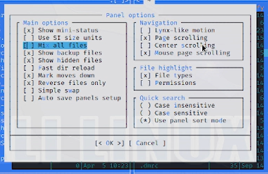{#fig:015 width=70%}

## Работа со встроенным текстовым редактором

При настройке mc текстовым редактором по умолчанию был выбран редактор nano.
Проведем в нем указанные в задании операции:

## Работа со встроенным текстовым редактором

* Для удаления строки текста используем комбинацию клавиш Ctrl+K
* Для копирования и вставки текста используем комбинации Shift+Ctrl+C, Shift+Ctrl+V
* Для сохранения файла используем Ctrl+S
* Отменим последнее действие сочетанием Alt+U
* Перейдите в конец и начало файла, везде написав некоторый текст. Для этого используем по два сочетания клавиш на операцию: Ctrl+W + Ctrl+V/Ctrl+Y для перехода в конец и начало соответственно.
* Для сохранения и закрытия файла используем Ctrl+Х

## Работа со встроенным текстовым редактором

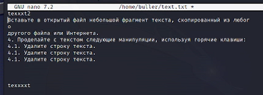{#fig:016 width=70%}

## Работа со встроенным текстовым редактором

Последним шагом попробуем открыть какой-нибудь файл кода и включить/отключить подсветку синтаксиса на нем. Для этого используем сочетания клавиш Alt+Y

## Работа со встроенным текстовым редактором

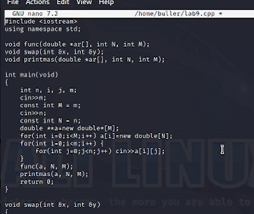{#fig:017 width=70%}

## Работа со встроенным текстовым редактором

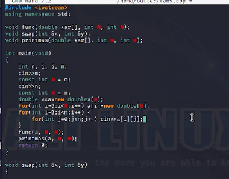{#fig:018 width=70%}

# Выводы

Освоены основные возможности командной оболочки Midnight Commander. Приобретены навыки практической работы по просмотру каталогов и файлов; манипуляций с ними.

