---
## Front matter
title: "Лабораторная работа №9"
subtitle: "Командная оболочка Midnight Commander"
author: "Буллер Татьяна Александровна"

## Generic otions
lang: ru-RU
toc-title: "Содержание"

## Bibliography
bibliography: bib/cite.bib
csl: pandoc/csl/gost-r-7-0-5-2008-numeric.csl

## Pdf output format
toc: true # Table of contents
toc-depth: 2
lof: true # List of figures
lot: false # List of tables
fontsize: 12pt
linestretch: 1.5
papersize: a4
documentclass: scrreprt
## I18n polyglossia
polyglossia-lang:
  name: russian
  options:
	- spelling=modern
	- babelshorthands=true
polyglossia-otherlangs:
  name: english
## I18n babel
babel-lang: russian
babel-otherlangs: english
## Fonts
mainfont: PT Serif
romanfont: PT Serif
sansfont: PT Sans
monofont: PT Mono
mainfontoptions: Ligatures=TeX
romanfontoptions: Ligatures=TeX
sansfontoptions: Ligatures=TeX,Scale=MatchLowercase
monofontoptions: Scale=MatchLowercase,Scale=0.9
## Biblatex
biblatex: true
biblio-style: "gost-numeric"
biblatexoptions:
  - parentracker=true
  - backend=biber
  - hyperref=auto
  - language=auto
  - autolang=other*
  - citestyle=gost-numeric
## Pandoc-crossref LaTeX customization
figureTitle: "Рис."
tableTitle: "Таблица"
listingTitle: "Листинг"
lofTitle: "Список иллюстраций"
lotTitle: "Список таблиц"
lolTitle: "Листинги"
## Misc options
indent: true
header-includes:
  - \usepackage{indentfirst}
  - \usepackage{float} # keep figures where there are in the text
  - \floatplacement{figure}{H} # keep figures where there are in the text
---

# Цель работы

Освоение основных возможностей командной оболочки Midnight Commander. Приобретение навыков практической работы по просмотру каталогов и файлов; манипуляций с ними.

# Выполнение лабораторной работы

## Встроенный редактор mc.

Откроем редактор с помощью соответсвующей команды. Видим, что окно разделено на две части (в начале работы на обеих открыта домашняя директория), внизу имеется строка для ввода команд либо выбора встроенных команд-кнопок.

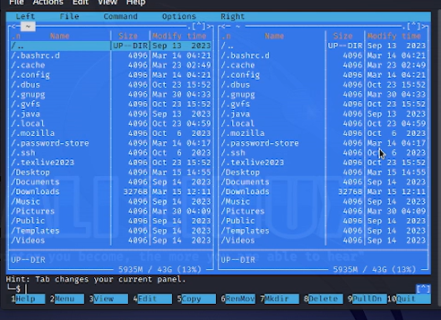{#fig:001 width=70%}

Меню пользователя открывается одной из кнопок снизу и содержит несколько команд для работы как с самим редактором, так и с файлами в нем.

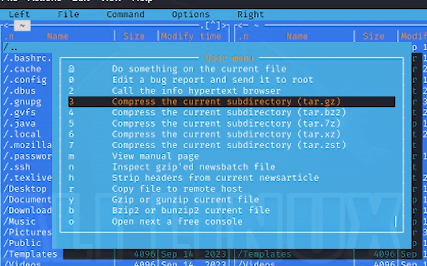{#fig:002 width=70%}

Для открытия файла в режиме просмотра используем клавишу F3. Файл открывается во встроенном редакторе и не доступен для редактирования в данном режиме.

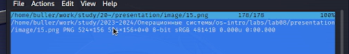{#fig:003 width=70%}

С помощью mc можно удобно копировать и перемещать файлы между директориями. В случае, если в разных окнах открыты разные директории, при попытке скопировать/переместить файл из одного окна будет автоматически предлагаться директория, открытая в другом окне.

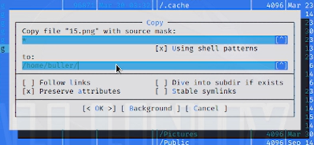{#fig:004 width=70%}

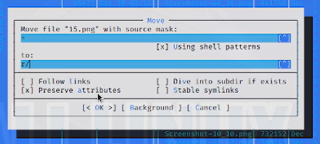{#fig:005 width=70%}

Можем проверять вывод некоторых команд для файлов, не вводя их непосредственно в командной строке: например, для того, чтобы проверить разрешения файла, нужно нажать отдельно комбинацию клавиш Ctrl+X, а затем C.

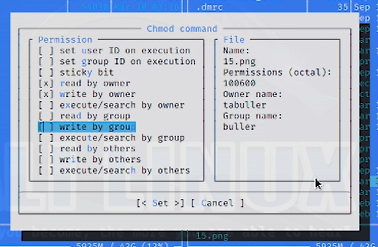{#fig:006 width=70%}

В самом редакторе возможно отображение информации о файле вместо второго окна директории. В информацию, отображаемую в таком выводе, входит дата последнего изменения, размер, разрешения файла и т.п.

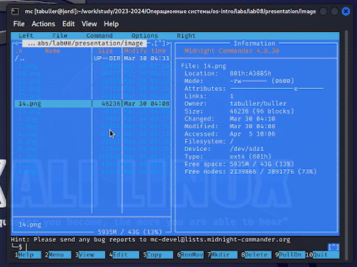{#fig:007 width=70%}

Работа с файлами осуществляется посредством горячих клавиш либо меню. Например, для открытия файла в режиме просмотра необходимо нажать F3, для редактирования файла - F4. В первом случае файл откроется в самом mc, во втором - в тектовом редакторе, выбранном при настройке шелла.

Кроме того, с помощью того же раздела менб можно создавать директории внутри выбранной директории.

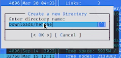{#fig:008 width=70%}

Шелл предусматривает также функцию поиска и фильтрации (grep+find). Для примера попробуем начать поиск с домашней директории и найти файлы, название которых начинается на ssh1 - таких два, сам ssh1 и ssh1.pub. 

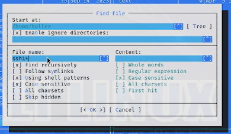{#fig:009 width=70%}

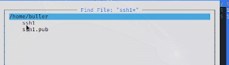{#fig:010 width=70%}

Все команды, введенные внутри шелла, сохраняются в истории. Окно истории можно открыть и воспроизвести одну из недавних команд заново, не переписывая ее вручную:

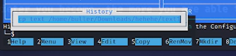{#fig:011 width=70%}

С помощью подменю команда можем открыть дерево директорий для более удобной навигации по ним. Перейдем с помощью этого из корневой директории в домашнюю:

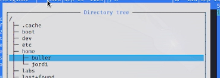{#fig:012 width=70%}

В том же подменю может открыть (и отредактировать) конфигурационные файлы: файлы меню (самого редактора или меню пользователя) и файл расширений.

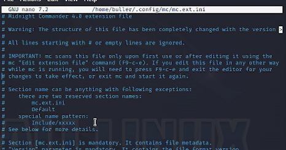{#fig:013 width=70%}

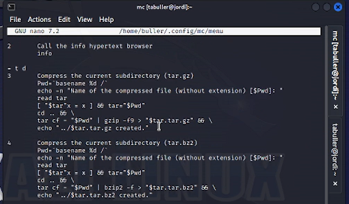{#fig:014 width=70%}

Редактор настраиваем: можно изменять внешний вид, редактировать отображение файлов, ширину окна и прочие элементы структуры экрана.

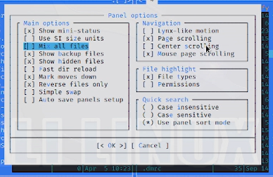{#fig:015 width=70%}

## Работа со встроенным текстовым редактором

При настройке mc текстовым редактором по умолчанию был выбран редактор nano.
Проведем в нем указанные в задании операции:

* Для удаления строки текста используем комбинацию клавиш Ctrl+K
* Для копирования и вставки текста используем комбинации Shift+Ctrl+C, Shift+Ctrl+V
* Для сохранения файла используем Ctrl+S
* Отменим последнее действие сочетанием Alt+U
* Перейдите в конец и начало файла, везде написав некоторый текст. Для этого используем по два сочетания клавиш на операцию: Ctrl+W + Ctrl+V/Ctrl+Y для перехода в конец и начало соответственно.
* Для сохранения и закрытия файла используем Ctrl+Х

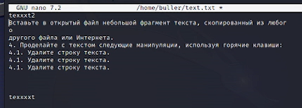{#fig:016 width=70%}

Последним шагом попробуем открыть какой-нибудь файл кода и включить/отключить подсветку синтаксиса на нем. Для этого используем сочетания клавиш Alt+Y

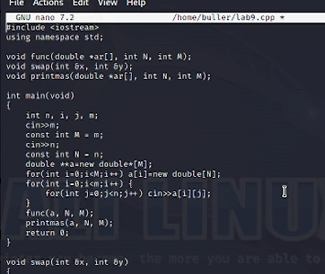{#fig:017 width=70%}

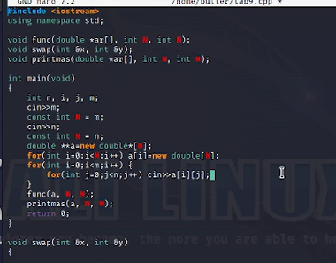{#fig:018 width=70%}

# Выводы

Освоены основные возможности командной оболочки Midnight Commander. Приобретены навыки практической работы по просмотру каталогов и файлов; манипуляций с ними.
