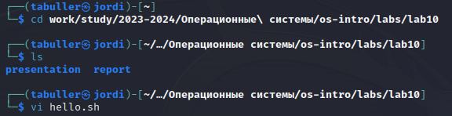
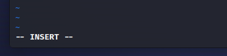
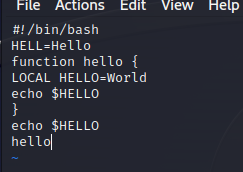
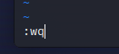
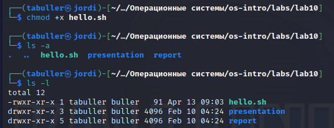
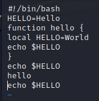

---
## Front matter
lang: ru-RU
title: Лабораторная работа №10
subtitle: Текстовой редактор vi
author:
  - Буллер Т. А.
institute:
  - Российский университет дружбы народов, Москва, Россия
date: 13 апреля 2024

## Formatting pdf
toc: false
toc-title: Содержание
slide_level: 2
aspectratio: 169
section-titles: true
theme: metropolis
header-includes:
 - \metroset{progressbar=frametitle,sectionpage=progressbar,numbering=fraction}
 - '\makeatletter'
 - '\beamer@ignorenonframefalse'
 - '\makeatother'
## I18n polyglossia
polyglossia-lang:
  name: russian
  options:
        - spelling=modern
        - babelshorthands=true
polyglossia-otherlangs:
  name: english
## I18n babel
babel-lang: russian
babel-otherlangs: english
## Fonts
mainfont: PT Serif
romanfont: PT Serif
sansfont: PT Sans
monofont: PT Mono
mainfontoptions: Ligatures=TeX
romanfontoptions: Ligatures=TeX
sansfontoptions: Ligatures=TeX,Scale=MatchLowercase
monofontoptions: Scale=MatchLowercase,Scale=0.9

---

# Информация

## Докладчик

:::::::::::::: {.columns align=center}
::: {.column width="70%"}

  * Буллер Татьяна Александровна
  * студент группы  НБИбд-01-23
  * Российский университет дружбы народов

:::
::: {.column width="30%"}

:::
::::::::::::::
# Вводная часть

## Объект и предмет исследования

- виртуальная машина Kali Linux
- текстовый редактор vi

## Цели и задачи

- Познакомиться с операционной системой Linux. Получить практические навыки работы с редактором vi, установленным по умолчанию практически во всех дистрибутивах.

## Материалы и методы

- Виртуальная машина Kali Linux
- текстовый редактор vi
- Процессор `pandoc` для входного формата Markdown
- Результирующие форматы
	- `pdf`
	- `html`
- Автоматизация процесса создания: `Makefile`

# Выполнение лабораторной работы

## Подготовка рабочего пространства.

В задании лабораторной работы предлагается создать новый каталог ~/work/os/lab06. Для этого можно использовать mkdir, но я предпочту воспользоваться существующим каталогом лабораторной работы. Создаю файл там:

{#fig:001 width=50%}

## Текстовый редактор.

По умолчанию файл открывается в командном режиме. Для того, чтобы перейти в режим вставки, нажимаем клавишу i -  внизу появляется строка, указывающая на то, что мы находимся в соответствующем режиме.

{#fig:002 width=50%}

## Текстовый редактор.

Вставляем скрипт, предложенный в задании лабораторной работы. После этого с помощью клавиши Esc возвращаемся в командный режим.

{#fig:003 width=50%}

## Текстовый редактор.

Вводим команду Shift+; (:), тем самым вызвав режим последней строки. Там вводим команду wq (write+quit) для того, чтобы записать изменения в файл и выйти из редактора.

{#fig:004 width=50%}

## Текстовый редактор.

Следующим шагом дадим право на исполнение файлу hello.sh (chmod +x hello.sh). Проверим правильность выполнения команды через вывод ls: видим, что название файла подсвечивается зеленым, значит он может быть исполнен.

{#fig:005 width=50%}

## Текстовый редактор.

Далее вновь откроем файл и произведем операции редактирования. С помощью перехода в уже известный режим вставки исправим  HELL на HELLO. После, вернувшись в командный режим, перейдем в начало четвертой строки и комбинацией клавиш сw заменим слово LOCAL на local. Нас перебросит в режим вставки, предварительно удалив слово после курсора.

Перейдем в конец файла и с помощью клавиши а из командного режима вставим строку echo $HELLO. Тут же удалим ее комбинацией клавиш dd, отменим изменения клавишей u и вновь используем Shift+; wq для сохранения файла и выхода из редактора.

## Текстовый редактор.

{#fig:006 width=70%}

# Выводы

Получены практические навыки работы с редактором vi, установленным по умолчанию практически во всех дистрибутивах.

