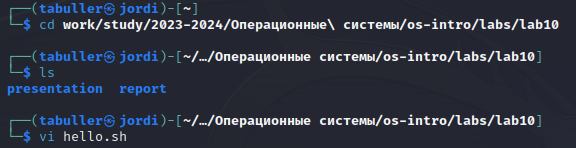
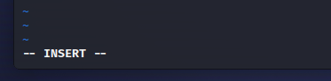
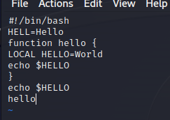
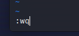
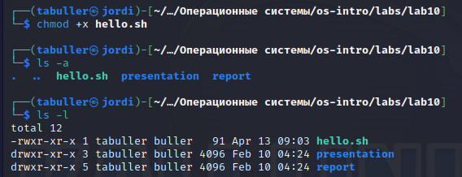
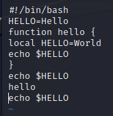

---
## Front matter
title: "Лабораторная работа №10"
subtitle: "Текстовой редактор vi"
author: "Буллер Татьяна Александровна"

## Generic otions
lang: ru-RU
toc-title: "Содержание"

## Bibliography
bibliography: bib/cite.bib
csl: pandoc/csl/gost-r-7-0-5-2008-numeric.csl

## Pdf output format
toc: true # Table of contents
toc-depth: 2
lof: true # List of figures
lot: false # List of tables
fontsize: 12pt
linestretch: 1.5
papersize: a4
documentclass: scrreprt
## I18n polyglossia
polyglossia-lang:
  name: russian
  options:
	- spelling=modern
	- babelshorthands=true
polyglossia-otherlangs:
  name: english
## I18n babel
babel-lang: russian
babel-otherlangs: english
## Fonts
mainfont: PT Serif
romanfont: PT Serif
sansfont: PT Sans
monofont: PT Mono
mainfontoptions: Ligatures=TeX
romanfontoptions: Ligatures=TeX
sansfontoptions: Ligatures=TeX,Scale=MatchLowercase
monofontoptions: Scale=MatchLowercase,Scale=0.9
## Biblatex
biblatex: true
biblio-style: "gost-numeric"
biblatexoptions:
  - parentracker=true
  - backend=biber
  - hyperref=auto
  - language=auto
  - autolang=other*
  - citestyle=gost-numeric
## Pandoc-crossref LaTeX customization
figureTitle: "Рис."
tableTitle: "Таблица"
listingTitle: "Листинг"
lofTitle: "Список иллюстраций"
lotTitle: "Список таблиц"
lolTitle: "Листинги"
## Misc options
indent: true
header-includes:
  - \usepackage{indentfirst}
  - \usepackage{float} # keep figures where there are in the text
  - \floatplacement{figure}{H} # keep figures where there are in the text
---

# Цель работы

Познакомиться с операционной системой Linux. Получить практические навыки работы с редактором vi, установленным по умолчанию практически во всех дистрибутивах.

# Выполнение лабораторной работы

## Подготовка рабочего пространства.

В задании лабораторной работы предлагается создать новый каталог ~/work/os/lab06. Для этого можно использовать mkdir, но я предпочту воспользоваться существующим каталогом лабораторной работы. Создаю файл там:

{#fig:001 width=70%}

## Текстовый редактор.

По умолчанию файл открывается в командном режиме. Для того, чтобы перейти в режим вставки, нажимаем клавишу i -  внизу появляется строка, указывающая на то, что мы находимся в соответствующем режиме.

{#fig:002 width=70%}

Вставляем скрипт, предложенный в задании лабораторной работы. После этого с помощью клавиши Esc возвращаемся в командный режим.

{#fig:003 width=70%}

Вводим команду Shift+; (:), тем самым вызвав режим последней строки. Там вводим команду wq (write+quit) для того, чтобы записать изменения в файл и выйти из редактора.

{#fig:004 width=70%}

Следующим шагом дадим право на исполнение файлу hello.sh (chmod +x hello.sh). Проверим правильность выполнения команды через вывод ls: видим, что название файла подсвечивается зеленым, значит он может быть исполнен.

{#fig:005 width=70%}

Далее вновь откроем файл и произведем операции редактирования. С помощью перехода в уже известный режим вставки исправим  HELL на HELLO. После, вернувшись в командный режим, перейдем в начало четвертой строки и комбинацией клавиш сw заменим слово LOCAL на local. Нас перебросит в режим вставки, предварительно удалив слово после курсора.

Перейдем в конец файла и с помощью клавиши а из командного режима вставим строку echo $HELLO. Тут же удалим ее комбинацией клавиш dd, отменим изменения клавишей u и вновь используем Shift+; wq для сохранения файла и выхода из редактора.

{#fig:006 width=70%}

# Выводы

Получены практические навыки работы с редактором vi, установленным по умолчанию практически во всех дистрибутивах.
