---
## Front matter
title: "Лабораторная работа №11"
subtitle: "Текстовой редактор emacs"
author: "Буллер Татьяна Александровна"

## Generic otions
lang: ru-RU
toc-title: "Содержание"

## Bibliography
bibliography: bib/cite.bib
csl: pandoc/csl/gost-r-7-0-5-2008-numeric.csl

## Pdf output format
toc: true # Table of contents
toc-depth: 2
lof: true # List of figures
lot: false # List of tables
fontsize: 12pt
linestretch: 1.5
papersize: a4
documentclass: scrreprt
## I18n polyglossia
polyglossia-lang:
  name: russian
  options:
	- spelling=modern
	- babelshorthands=true
polyglossia-otherlangs:
  name: english
## I18n babel
babel-lang: russian
babel-otherlangs: english
## Fonts
mainfont: PT Serif
romanfont: PT Serif
sansfont: PT Sans
monofont: PT Mono
mainfontoptions: Ligatures=TeX
romanfontoptions: Ligatures=TeX
sansfontoptions: Ligatures=TeX,Scale=MatchLowercase
monofontoptions: Scale=MatchLowercase,Scale=0.9
## Biblatex
biblatex: true
biblio-style: "gost-numeric"
biblatexoptions:
  - parentracker=true
  - backend=biber
  - hyperref=auto
  - language=auto
  - autolang=other*
  - citestyle=gost-numeric
## Pandoc-crossref LaTeX customization
figureTitle: "Рис."
tableTitle: "Таблица"
listingTitle: "Листинг"
lofTitle: "Список иллюстраций"
lotTitle: "Список таблиц"
lolTitle: "Листинги"
## Misc options
indent: true
header-includes:
  - \usepackage{indentfirst}
  - \usepackage{float} # keep figures where there are in the text
  - \floatplacement{figure}{H} # keep figures where there are in the text
---

# Цель работы

Познакомиться с операционной системой Linux. Получить практические навыки работы с редактором Emacs.

# Выполнение лабораторной работы

## Создание файла

Откроем редактор с помощью соответсвующей команды. Открывается графический интерфейс с командной строкой снизу, которая отображает введенные комбинации клавиш и выдает подсказки к ним при работе:

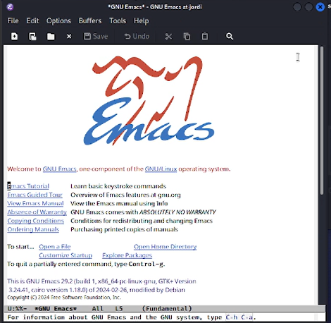{#fig:001 width=70%}

Для создания файла используем комбинацию Ctrl+x Ctrl+f и введем название файла. После введения команды файл создается автоматически.

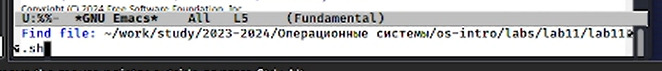{#fig:002 width=70%}

Далее введем в файл скрипт, предложенный в задании лабораторной работы, и сохраним полученный текст в файле комбинацией Ctrl+x Ctrl+s.

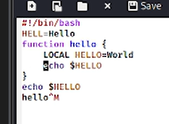{#fig:003 width=70%}

## Редактирование файла

После этого по заданию требуется выполнить некоторые махинации с текстом в файле. Займемся этим:
Для того, чтобы вырезать одной командой целую строку, используем комбинацию клавиш Ctrl+k. Чтобы вставить эту строку в конец файла для начала перейдем в конец соответственно (Alt+>) и вставим текст с помощью Ctrl+y.
Для того, чтобы выделить область текста, нажмем Ctrl+Space. На выделенном символе появится метка, которую в дальнейшем нужно протащить с помощью клавиш стрелочек до нужной части текста.

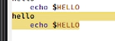{#fig:004 width=70%}

Скопируем область в буфер обмена, используя Alt+w. Вставим область в конец файла, как уже делали до этого, вновь выделим ее и на этот раз вырежем Ctrl+w. Последним шагом на данном этапе отменим последнее действие: Ctrl+/.

Отметим так же команды по перемещению курсора: Ctrl+e/Ctrl+a для перемещения в начало/конец строки соответственно и Alt+>/Alt+< для перемещения в начало/конец всего текста в файле.

## Работа с буферами

Далее переходим к работе с буферами. Выведем их список на экран, использовав Ctrl+х Ctrl+b. 

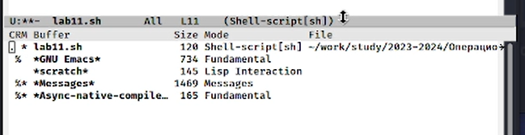{#fig:005 width=70%}

Перейдем в случайный буфер, предварительно переключившись во вновь открытое окно (Ctrl+х). Для примера был открыт буфер \*scratch\*. Вернемся в рабочий буфер, уже не открывая окна со списком буферов: Ctrl+х b (Ctrl+b - с открытием окна, b - без открытия).

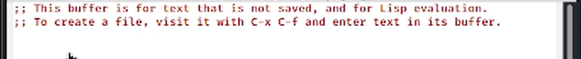{#fig:006 width=70%}

## Работа с окнами

Далее разделим рабочее окно на четыре части: для начала создадим доп. окно по вертикали (Сtrl+3), затем каждое из созданных окон разделим еще по горизонтали (Ctrl+2).

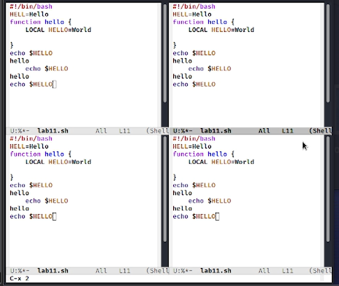{#fig:007 width=70%}

## Режим поиска

Введем в открытые окна новый текст и попробуем найти какое-нибудь слово оттуда, используя режим поиска (Ctrl+s). Видим, что уже при наборе текста в активном окне подсвачиваются идентичные части в файле. Нажав ту же комбинацию клавиш еще раз видим все результаты поиска во всех окнах.

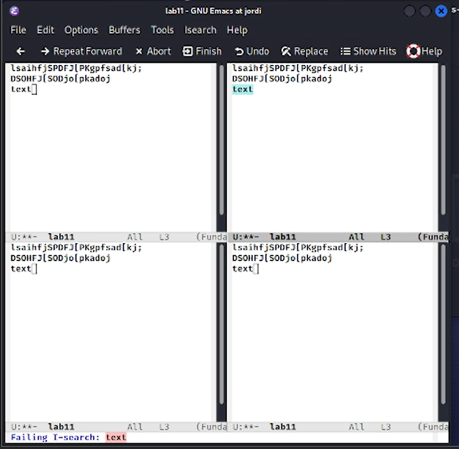{#fig:008 width=70%}

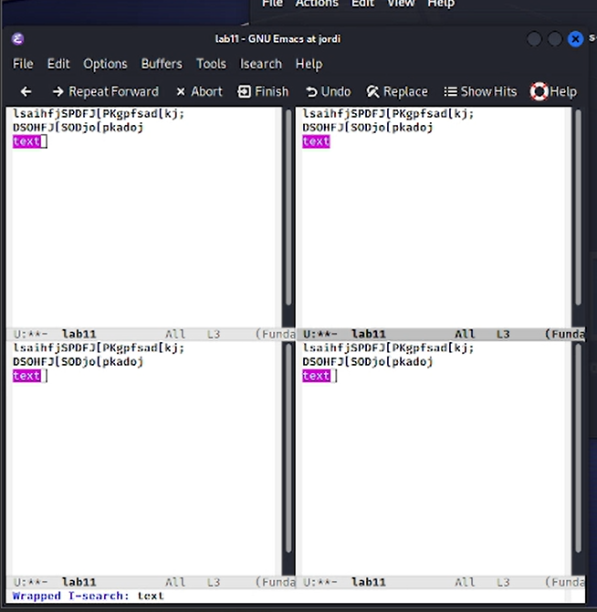{#fig:009 width=70%}

Далее рассмотрим режим поиска и замены. Перейдем в него, нажав  Alt+%. Выберем текст, который будем заменять, введем текст, НА который будем заменять и подтвердим выбор, введя !.

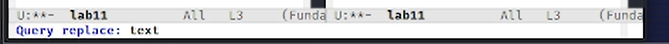{#fig:010 width=70%}

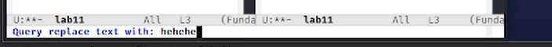{#fig:011 width=70%}

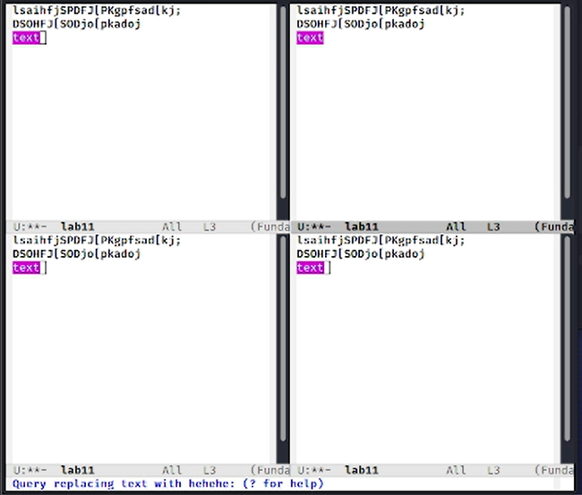{#fig:012 width=70%}

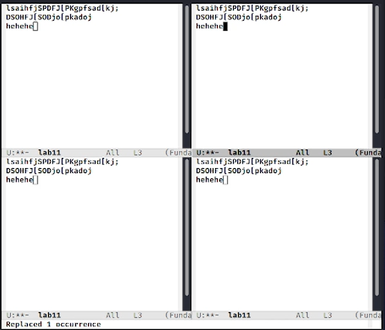{#fig:013 width=70%}

Последним шагом рассмотрим другой вариант поиска: Alt+s o. Это поиск по регулярным выражениям, что и отличает его от рассмотренных ранее вариантов.

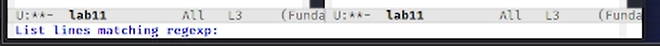{#fig:014 width=70%}

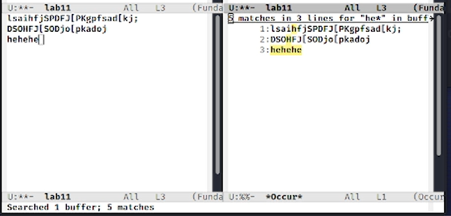{#fig:015 width=70%}

# Выводы

Получены практические навыки работы с редактором Emacs.
