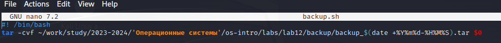
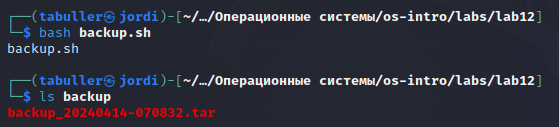
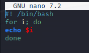
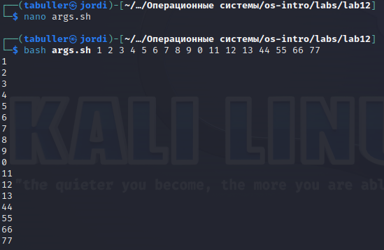
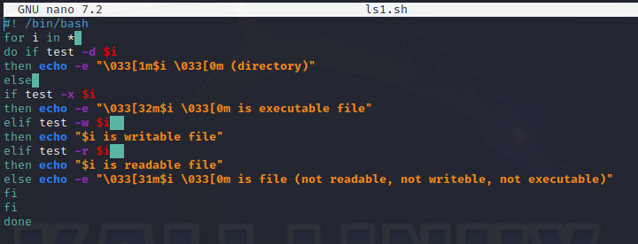
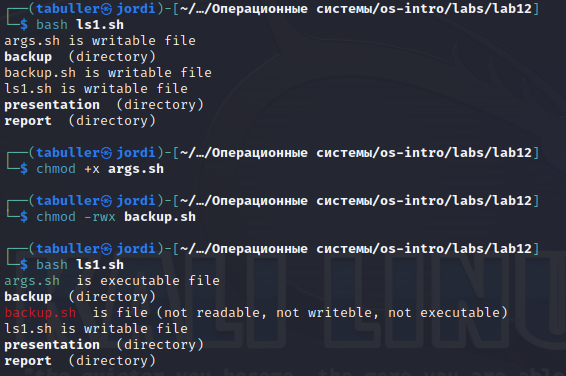
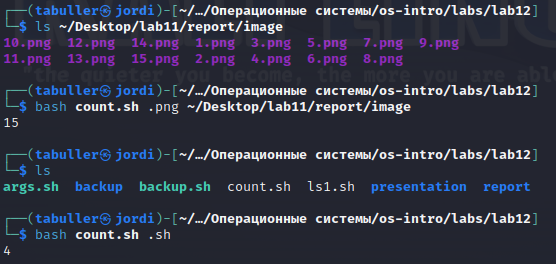

---
## Front matter
lang: ru-RU
title: Лабораторная работа №12
subtitle: Программирование в командном процессоре ОС UNIX. Командные файлы
author:
  - Буллер Т. А.
institute:
  - Российский университет дружбы народов, Москва, Россия
date: 14 апреля 2024

## Formatting pdf
toc: false
toc-title: Содержание
slide_level: 2
aspectratio: 169
section-titles: true
theme: metropolis
header-includes:
 - \metroset{progressbar=frametitle,sectionpage=progressbar,numbering=fraction}
 - '\makeatletter'
 - '\beamer@ignorenonframefalse'
 - '\makeatother'
## I18n polyglossia
polyglossia-lang:
  name: russian
  options:
        - spelling=modern
        - babelshorthands=true
polyglossia-otherlangs:
  name: english
## I18n babel
babel-lang: russian
babel-otherlangs: english
## Fonts
mainfont: PT Serif
romanfont: PT Serif
sansfont: PT Sans
monofont: PT Mono
mainfontoptions: Ligatures=TeX
romanfontoptions: Ligatures=TeX
sansfontoptions: Ligatures=TeX,Scale=MatchLowercase
monofontoptions: Scale=MatchLowercase,Scale=0.9

---

# Информация

## Докладчик

:::::::::::::: {.columns align=center}
::: {.column width="70%"}

  * Буллер Татьяна Александровна
  * студент группы  НБИбд-01-23
  * Российский университет дружбы народов

:::
::: {.column width="30%"}

:::
::::::::::::::
# Вводная часть

## Объект и предмет исследования

- виртуальная машина Kali Linux
- текстовый редактор nano
- командная оболочка bash

## Цели и задачи

- Изучить основы программирования в оболочке ОС UNIX/Linux. Научиться писать
небольшие командные файлы.

## Материалы и методы

- виртуальная машина Kali Linux
- текстовый редактор nano
- командная оболочка bash
- Процессор `pandoc` для входного формата Markdown
- Результирующие форматы
	- `pdf`
	- `html`
- Автоматизация процесса создания: `Makefile`

# Выполнение лабораторной работы

## Резервное копирование

Скрипт для резервного копирования можно написать в одну строку: для этого используем команду архиватора, которой укажем создать файл в заранее созданной директории backup, и подадим в качестве второго аргумента имя исполняемого файла ($0). Для того, чтобы все резервные копии различались можду собой, пропишем первому аргументу сохранять файл не просто со статичным названием, а добавляя дату создания в конец (переменная дата в формате год+месяц+число-час+минута+секунда).

## Резервное копирование

{#fig:001 width=70%}

## Резервное копирование

После исполнения скрипта проверим директорию backup командой ls: видим, что создался файл архива резервной копии, в названии которого прописана дата его создания.

## Резервное копирование

{#fig:002 width=70%}

## Последовательная печать аргументов

Мы уже обрабатывали аргумент $0 в предыдущем скрипте. Теперь обработаем все, что будет подано вместе с командой запуска скрипта: проще всего для этого использовать цикл. Пока значение i существует, будет печататься аргумент с соответствующим номером.

## Последовательная печать аргументов

{#fig:003 width=70%}

## Последовательная печать аргументов

Подадим на печать сколько угодно много аргументов и проверим, справляется ли скрипт с поставленной задачей:

## Последовательная печать аргументов

{#fig:004 width=70%}

## Аналог ls

Работая с этим скриптом будем использовать цикл для всех файлов текущего каталога. Сперва проверим, является ли файл директорией (test -d) и если да, то выведем информацию об этом, выделив название файла жирным шрифтом.
Все остальные файлы, очевидно, являются файлами. Проверим их на возможность исполнения, записи или чтения (-х -w -r) и выведем соответствующие сообщения. Если файл с разрешением на запись - выделим его зеленым, если ни одного из разрешений у файла нет - выделим красным.

## Аналог ls

{#fig:005 width=70%}

## Аналог ls

Проверим: сам скрипт выполняется. Для того, чтобы проверить корректность отображения цветов, изменим разрешения у пары файлов и снова посмотрим на вывод.

## Аналог ls

{#fig:006 width=70%}

## Счетчик-фильтр

Снова работаем с аргументами на входе. Первым аргументом принимаем формат, вторым - зону поиска. Для реализации скрипта сохраним в массив вывод команды grep по результату ls нужного каталога и выведем на экран количество элементов массива.

## Счетчик-фильтр

{#fig:007 width=70%}

## Счетчик-фильтр

Проверим для рабочей директории (не подавая второго аргумента) и для случайно выбранной директории. В обоих случаях скрипт справляется с поставленной задачей корректно.

## Счетчик-фильтр

{#fig:008 width=70%}

# Выводы

Изучены основы программирования в оболочке ОС UNIX/Linux. Приобретены навыки написания небольших командных файлов.

