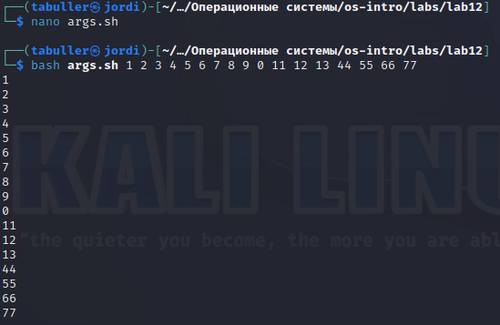

---
## Front matter
title: "Лабораторная работа №12"
subtitle: "Программирование в командном процессоре ОС UNIX. Командные файлы"
author: "Буллер Татьяна Александровна"

## Generic otions
lang: ru-RU
toc-title: "Содержание"

## Bibliography
bibliography: bib/cite.bib
csl: pandoc/csl/gost-r-7-0-5-2008-numeric.csl

## Pdf output format
toc: true # Table of contents
toc-depth: 2
lof: true # List of figures
lot: false # List of tables
fontsize: 12pt
linestretch: 1.5
papersize: a4
documentclass: scrreprt
## I18n polyglossia
polyglossia-lang:
  name: russian
  options:
	- spelling=modern
	- babelshorthands=true
polyglossia-otherlangs:
  name: english
## I18n babel
babel-lang: russian
babel-otherlangs: english
## Fonts
mainfont: PT Serif
romanfont: PT Serif
sansfont: PT Sans
monofont: PT Mono
mainfontoptions: Ligatures=TeX
romanfontoptions: Ligatures=TeX
sansfontoptions: Ligatures=TeX,Scale=MatchLowercase
monofontoptions: Scale=MatchLowercase,Scale=0.9
## Biblatex
biblatex: true
biblio-style: "gost-numeric"
biblatexoptions:
  - parentracker=true
  - backend=biber
  - hyperref=auto
  - language=auto
  - autolang=other*
  - citestyle=gost-numeric
## Pandoc-crossref LaTeX customization
figureTitle: "Рис."
tableTitle: "Таблица"
listingTitle: "Листинг"
lofTitle: "Список иллюстраций"
lotTitle: "Список таблиц"
lolTitle: "Листинги"
## Misc options
indent: true
header-includes:
  - \usepackage{indentfirst}
  - \usepackage{float} # keep figures where there are in the text
  - \floatplacement{figure}{H} # keep figures where there are in the text
---

# Цель работы

Изучить основы программирования в оболочке ОС UNIX/Linux. Научиться писать
небольшие командные файлы.

# Выполнение лабораторной работы

## Резервное копирование

Скрипт для резервного копирования можно написать в одну строку: для этого используем команду архиватора, которой укажем создать файл в заранее созданной директории backup, и подадим в качестве второго аргумента имя исполняемого файла ($0). Для того, чтобы все резервные копии различались можду собой, пропишем первому аргументу сохранять файл не просто со статичным названием, а добавляя дату создания в конец (переменная дата в формате год+месяц+число-час+минута+секунда).

{#fig:001 width=70%}

После исполнения скрипта проверим директорию backup командой ls: видим, что создался файл архива резервной копии, в названии которого прописана дата его создания.

{#fig:002 width=70%}

## Последовательная печать аргументов

Мы уже обрабатывали аргумент $0 в предыдущем скрипте. Теперь обработаем все, что будет подано вместе с командой запуска скрипта: проще всего для этого использовать цикл. Пока значение i существует, будет печататься аргумент с соответствующим номером.

{#fig:003 width=70%}

Подадим на печать сколько угодно много аргументов и проверим, справляется ли скрипт с поставленной задачей:

{#fig:004 width=70%}

## Аналог ls

Работая с этим скриптом будем использовать цикл для всех файлов текущего каталога. Сперва проверим, является ли файл директорией (test -d) и если да, то выведем информацию об этом, выделив название файла жирным шрифтом.
Все остальные файлы, очевидно, являются файлами. Проверим их на возможность исполнения, записи или чтения (-х -w -r) и выведем соответствующие сообщения. Если файл с разрешением на запись - выделим его зеленым, если ни одного из разрешений у файла нет - выделим красным.

{#fig:005 width=70%}

Проверим: сам скрипт выполняется. Для того, чтобы проверить корректность отображения цветов, изменим разрешения у пары файлов и снова посмотрим на вывод.

{#fig:006 width=70%}

## Счетчик-фильтр

Снова работаем с аргументами на входе. Первым аргументом принимаем формат, вторым - зону поиска. Для реализации скрипта сохраним в массив вывод команды grep по результату ls нужного каталога и выведем на экран количество элементов массива.

{#fig:007 width=70%}

Проверим для рабочей директории (не подавая второго аргумента) и для случайно выбранной директории. В обоих случаях скрипт справляется с поставленной задачей корректно.

{#fig:008 width=70%}

# Выводы

Изучены основы программирования в оболочке ОС UNIX/Linux. Приобретены навыки написания небольших командных файлов.
