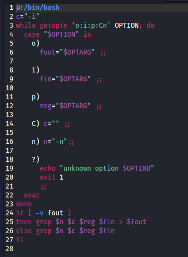
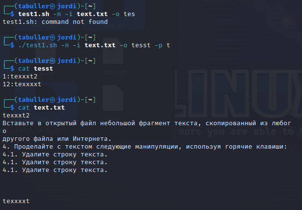
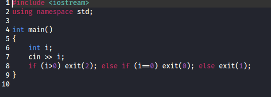
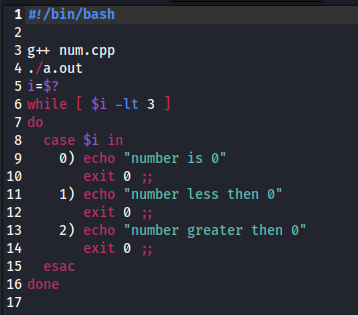
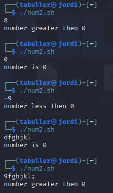
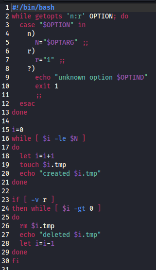
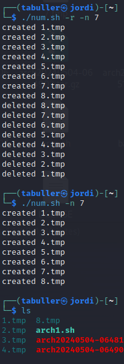
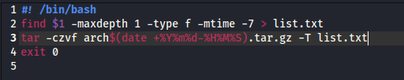
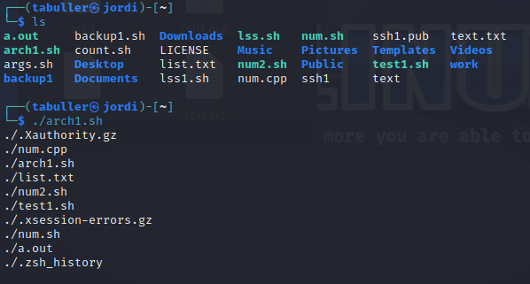

---
## Front matter
lang: ru-RU
title: Лабораторная работа №12
subtitle: Программирование в командном процессоре ОС UNIX. Ветвления и циклы
author:
  - Буллер Т. А.
institute:
  - Российский университет дружбы народов, Москва, Россия
date: 4 мая 2024

## Formatting pdf
toc: false
toc-title: Содержание
slide_level: 2
aspectratio: 169
section-titles: true
theme: metropolis
header-includes:
 - \metroset{progressbar=frametitle,sectionpage=progressbar,numbering=fraction}
 - '\makeatletter'
 - '\beamer@ignorenonframefalse'
 - '\makeatother'
## I18n polyglossia
polyglossia-lang:
  name: russian
  options:
        - spelling=modern
        - babelshorthands=true
polyglossia-otherlangs:
  name: english
## I18n babel
babel-lang: russian
babel-otherlangs: english
## Fonts
mainfont: PT Serif
romanfont: PT Serif
sansfont: PT Sans
monofont: PT Mono
mainfontoptions: Ligatures=TeX
romanfontoptions: Ligatures=TeX
sansfontoptions: Ligatures=TeX,Scale=MatchLowercase
monofontoptions: Scale=MatchLowercase,Scale=0.9

---

# Информация

## Докладчик

:::::::::::::: {.columns align=center}
::: {.column width="70%"}

  * Буллер Татьяна Александровна
  * студент группы  НБИбд-01-23
  * Российский университет дружбы народов

:::
::: {.column width="30%"}

:::
::::::::::::::
# Вводная часть

## Объект и предмет исследования

- виртуальная машина Kali Linux
- текстовый редактор nano
- командная оболочка bash

## Цели и задачи

- Изучить основы программирования в оболочке ОС UNIX. Научится писать более сложные командные файлы с использованием логических управляющих конструкций и циклов.

## Материалы и методы

- виртуальная машина Kali Linux
- текстовый редактор nano
- командная оболочка bash
- Процессор `pandoc` для входного формата Markdown
- Результирующие форматы
	- `pdf`
	- `html`
- Автоматизация процесса создания: `Makefile`

# Выполнение лабораторной работы

## Обработка ключей

Используя команды getopts и grep необходимо написать командный файл, который анализирует командную строку с ключами:
– -i inputfile — прочитать данные из указанного файла;
– -o outputfile — вывести данные в указанный файл;
– -p шаблон — указать шаблон для поиска;
– -C — различать большие и малые буквы;
– -n — выдавать номера строк.

## Обработка ключей

Принимать некоторое значение должны 3 ключа: -i, -o, -p. Чтобы указать на это, после их обозначения в команде getopts ставим двоеточие. Далее рассмотрим каждый случай через конструкцию case:
– если получили ключ -i - в переменную fin введем значение аргумента после ключа (файл анализа).
– если получили ключ -o - в переменную fout введем значение аргумента после ключа (файл вывода).
– если получили ключ -p - в переменную reg введем значение аргумента после ключа (регулярное выражение для поиска grep).

## Обработка ключей

По умолчанию grep различает большие и маленькие буквы. Для того, чтобы он этого не делал, используем опцию -i. Так как опция -С должна задавать программе различать регистры, то ставим, что по умолчанию она их НЕ различает, а при получении опции обнуляем переменную.
– -n — опция, выдающая номера строк. Точно так же она используется и в grep, поэтому при получении этого ключа просто сохраняем его в переменную и в дальнейшем вставляем в команду.

## Обработка ключей

В случае, если мы получили файл вывода, то нужно перенаправить результат выполнения туда. В противном случае переменная fout останется пустой, вывод будет произведен в консоль.

## Обработка ключей

{#fig:001 width=60%}

## Обработка ключей

После исполнения скрипта проверим с его помощью текстовый файл одной из предыдущих лабораторных работ: видим, что создался файл вывода с указанным названием и вывод в нем соответствует заданному регулярному выражению.

## Обработка ключей

{#fig:002 width=60%}

## Обработка кодов завершения

Требуется написать на языке Си программу, которая вводит число и определяет, является ли оно больше нуля, меньше нуля или равно нулю. Командный файл должен вызывать эту программу и, проанализировав с помощью команды $?, выдать сообщение о том, какое число было введено.

## Обработка кодов завершения

Для выполнения задания напишем простую программу на языке Си: если число больше 0 - код завершения 2, равно 0 - код завершения 0, меньше - код завершения 1. На вход принимаем целое число. Необходимо учитывать, что в случае, если в аргумент попадет строка, она будет либо приравняна к 0, либо в аргумент пойдут самые первые численные символы.

## Обработка кодов завершения

{#fig:003 width=70%}

## Обработка кодов завершения

Далее работаем с командой $?, определяющей код завершения программы. В самом скрипте вызовем программу, после чего приравняем переменную i к значению кода завершения и переберем варианты:

## Обработка кодов завершения

{#fig:004 width=60%}

## Обработка кодов завершения

Для проверки работы скрипта используем несколько вариантов аргумента: больше нуля, 0, меньше нуля и две строки: начинающуюся с числа и начинающуюся с буквы. В двух последних случаях видим, что скрипт выполняется для 0 и для 9 соответственно.

## Обработка кодов завершения

{#fig:005 width=60%}

## Создание и удаление некоторого числа файлов.

Зададим команде два флага: -n  и -r. При получении флага -n будем ожидать дальнейший аргумент в виде числа файлов к созданию, второй же флаг будет активировать команду на удаление созданных файлов. Механизм для обоих реализуем с помощью цикла while, но в первом случае создаем, а во втором, если флаг на удаление присутствует - удаляем файлы.

## Создание и удаление некоторого числа файлов.

{#fig:006 width=70%}

## Создание и удаление некоторого числа файлов.

{#fig:007 width=70%}

## Архивирование файлов по параметру

Последний скрипт - архиватор. Для начала выполним команду find, которая найдет все файлы (-type f) в заданной директории (-maxdepth 1), созданные менее недели назад (-mtime -7). Результат выполнения сохраняем в текстовый файл, после чего создаем архив по списку с помощью флага -Т.

## Архивирование файлов по параметру

{#fig:008 width=60%}

В результате видим вывод файлов, запакованных в архив, и получаем сам архив соответственно:

{#fig:009 width=50%}

# Выводы

Изучены основы программирования в оболочке ОС UNIX/Linux. Написаны более сложные командные файлы с использованием логических управляющих конструкций и циклов.

