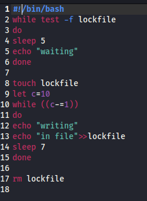
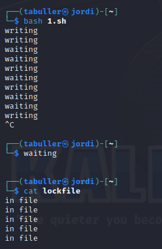
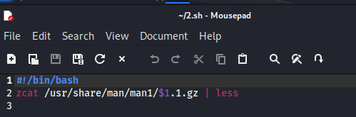
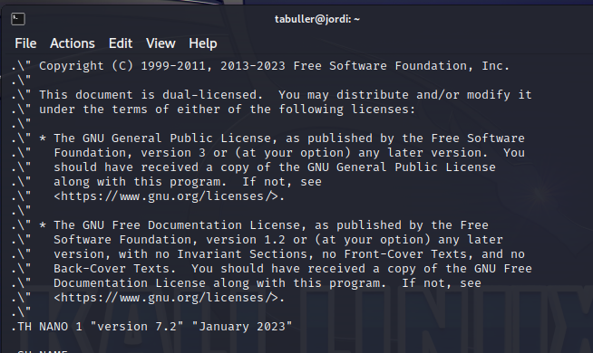
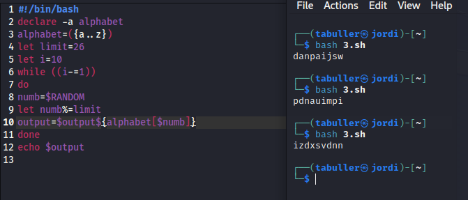

---
## Front matter
title: "Лабораторная работа №14"
subtitle: "Программирование в командном процессоре ОС UNIX. Расширенное программирование"
author: "Буллер Татьяна Александровна"

## Generic otions
lang: ru-RU
toc-title: "Содержание"

## Bibliography
bibliography: bib/cite.bib
csl: pandoc/csl/gost-r-7-0-5-2008-numeric.csl

## Pdf output format
toc: true # Table of contents
toc-depth: 2
lof: true # List of figures
lot: false # List of tables
fontsize: 12pt
linestretch: 1.5
papersize: a4
documentclass: scrreprt
## I18n polyglossia
polyglossia-lang:
  name: russian
  options:
	- spelling=modern
	- babelshorthands=true
polyglossia-otherlangs:
  name: english
## I18n babel
babel-lang: russian
babel-otherlangs: english
## Fonts
mainfont: PT Serif
romanfont: PT Serif
sansfont: PT Sans
monofont: PT Mono
mainfontoptions: Ligatures=TeX
romanfontoptions: Ligatures=TeX
sansfontoptions: Ligatures=TeX,Scale=MatchLowercase
monofontoptions: Scale=MatchLowercase,Scale=0.9
## Biblatex
biblatex: true
biblio-style: "gost-numeric"
biblatexoptions:
  - parentracker=true
  - backend=biber
  - hyperref=auto
  - language=auto
  - autolang=other*
  - citestyle=gost-numeric
## Pandoc-crossref LaTeX customization
figureTitle: "Рис."
tableTitle: "Таблица"
listingTitle: "Листинг"
lofTitle: "Список иллюстраций"
lotTitle: "Список таблиц"
lolTitle: "Листинги"
## Misc options
indent: true
header-includes:
  - \usepackage{indentfirst}
  - \usepackage{float} # keep figures where there are in the text
  - \floatplacement{figure}{H} # keep figures where there are in the text
---

# Цель работы

Изучить основы программирования в оболочке ОС UNIX. Научиться писать более
сложные командные файлы с использованием логических управляющих конструкций
и циклов.

# Выполнение лабораторной работы

## Семафоры

Необходимо написать командный файл, реализующий упрощённый механизм семафоров. 
В случае, если файд уже используется некоторым другим процессом, командный файл ожидает его освобождения 5 секунд и выдает соответствующее сообщение. Затем, если файл не освободился, цикл повторяется. Если же файл после ожидания стал свободен, то выводится сообщение о записи в файл и в сам файл записывается некоторая фраза. 

{#fig:001 width=70%}

Проверим работу файла: откроем два окна терминала и в одном из них запустим файл в привелигированном режиме, а во втором - в фоновом, переведя вывод в первое окно. Для перевода вывода в окно графического терминала используем команду  ```> /dev/pts/number```, где number - номер графического интерфейса.

{#fig:002 width=70%}

Видим, что запущенный в первом окне файл первое время производит запись без проблем. Потом, когда подключается второй процесс, один из файлов начинает выводить сообщения об ожидании, когда файл записи оказывается занят.

{#fig:003 width=70%}

## Man с помощью командного файла

содержимое каталога /usr/share/man/man1 - архивы текстовых файлов, содержащих справку по большинству установленных в системе программ и команд. На некоторых дистрибутивах Linux каждый архив можно открыть командой less, сразу же просмотрев содержимое справки, однако в случае Kali эта опция  less по умолчанию отключена. Для того, чтобы открыть архив .gz на Kali использую zcat и перевожу вывод в less. В качестве аргумента передаем название программы, которое вставится в код скрипта.

{#fig:004 width=70%}

{#fig:005 width=70%}

## Случайная комбинация

Зададим переменную alphabet: массив, который заполним латинскими маленькими буквами (a..z). Далее зададим переменную-ограничитель и проведем цикл по ней: на каждой итерации в переменную numb запишем случайное число, которое ограничим установленным до этого лимитом. Заполним полученными элементами переменную-массив вывода и вызовем ее в конце программы:

{#fig:006 width=70%}

# Выводы

Изучены основы программирования в оболочке ОС UNIX/Linux. Написаны более сложные командные файлы с использованием логических управляющих конструкций и циклов.
