---
## Front matter
lang: ru-RU
title: Индивидуальный проект - этап 3
subtitle: Добавление к сайту достижений
author:
  - Буллер Т. А.
institute:
  - Российский университет дружбы народов, Москва, Россия
date: 5 апреля 2024

## Formatting pdf
toc: false
toc-title: Содержание
slide_level: 2
aspectratio: 169
section-titles: true
theme: metropolis
header-includes:
 - \metroset{progressbar=frametitle,sectionpage=progressbar,numbering=fraction}
 - '\makeatletter'
 - '\beamer@ignorenonframefalse'
 - '\makeatother'
## I18n polyglossia
polyglossia-lang:
  name: russian
  options:
        - spelling=modern
        - babelshorthands=true
polyglossia-otherlangs:
  name: english
## I18n babel
babel-lang: russian
babel-otherlangs: english
## Fonts
mainfont: PT Serif
romanfont: PT Serif
sansfont: PT Sans
monofont: PT Mono
mainfontoptions: Ligatures=TeX
romanfontoptions: Ligatures=TeX
sansfontoptions: Ligatures=TeX,Scale=MatchLowercase
monofontoptions: Scale=MatchLowercase,Scale=0.9

---

# Информация

## Докладчик

:::::::::::::: {.columns align=center}
::: {.column width="70%"}

  * Буллер Татьяна Александровна
  * студент группы  НБИбд-01-23
  * Российский университет дружбы народов

:::
::: {.column width="30%"}

:::
::::::::::::::
# Вводная часть

## Объект и предмет исследования

- Процесс создания постов в Hugo
- Процесс редактирования данных и списков в Hugo

## Цели и задачи

- Получение навыков работы со списками, постами и изображениями в редакторе сайтов Hugo.

## Материалы и методы

- Редактор сайтов Hugo
- github codespace
- Процессор `pandoc` для входного формата Markdown
- Результирующие форматы
	- `pdf`
	- `html`
- Автоматизация процесса создания: `Makefile`

# Ход работы

## Добавление информации о навыках (Skills)

Редактируем элементы списка: заменяем под себя иконки (стандартный пакет иконок - font awesome (fas), но предусмотрены несколько других пакетов и возможность добавлять пользовательские файлы), названия навыков и процент заполнения шкалы. Присутствует так же возможность добавить описание.

## Добавление информации о навыках (Skills)

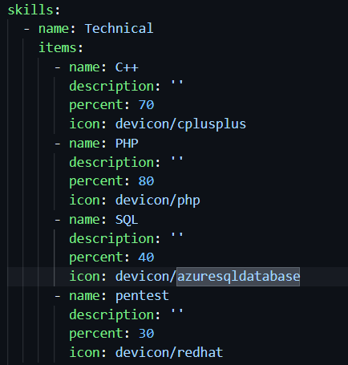{#fig:001 width=70%}

## Добавление информации о навыках (Skills)

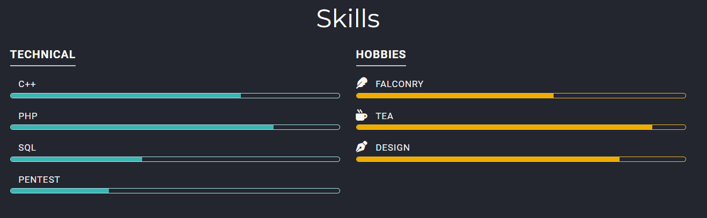{#fig:002 width=70%}

## Добавление информации об опыте (Experience)

Опыт на сайте представлен в виде опыта работы. Его у меня нет, но есть невероятное множество прочих достижений. При заполнении опыта вновь работаем со списками, меняем под себя даты, иконки, места, названия и описание.

## Добавление информации об опыте (Experience)

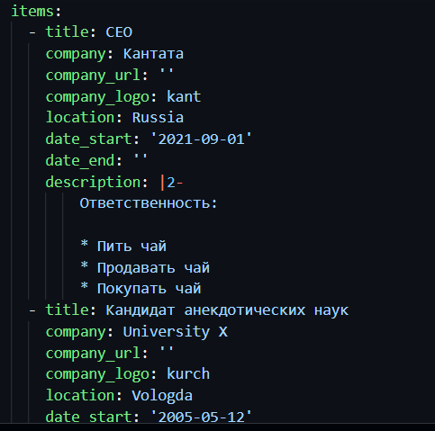{#fig:003 width=70%}

## Добавление информации об опыте (Experience)

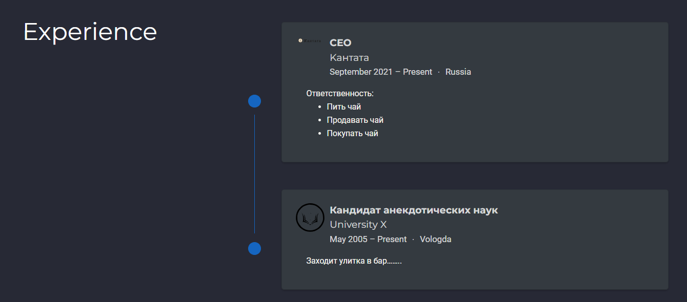{#fig:004 width=70%}

## Добавление информации о достижениях (Accomplishments)

Достижения - тоже список. Здесь также меняем даты, названия, придумываем пару цепляющих описаний и добавляем иконки. Также добавила ссылки на сайты компаний и организаций. В этот раздел можно также прикрепить сертификаты, но их у меня нет времени рисовать.

## Добавление информации о достижениях (Accomplishments)

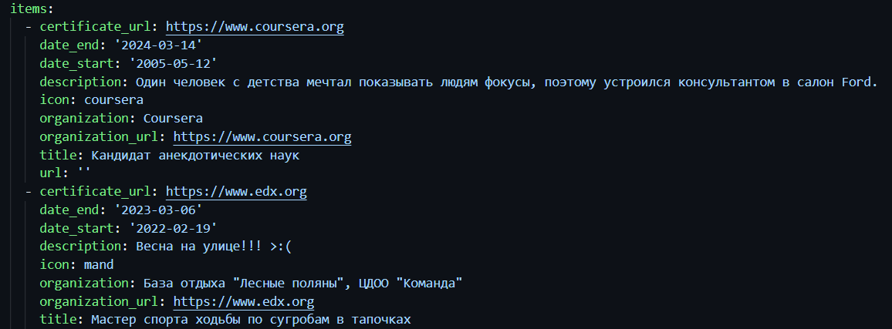{#fig:005 width=70%}

## Добавление информации о достижениях (Accomplishments)

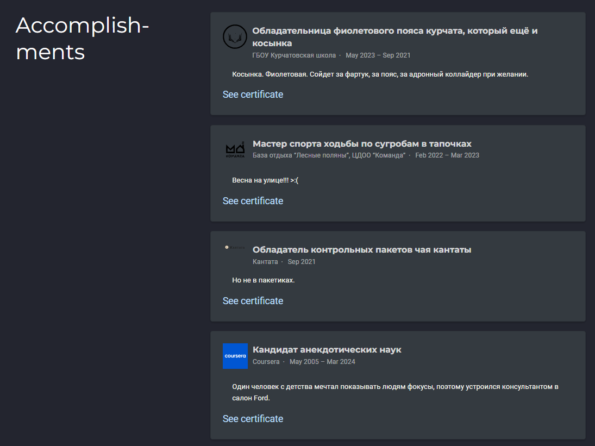{#fig:006 width=70%}

## Создание постов

Для создания постов переходим в директорию post. Обязательный элемент поста - индексный файл с шапкой, где должны быть указаны заголовок, дата и краткое описание содержания поста.

## Создание постов

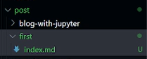{#fig:009 width=70%}

## Создание постов

Для того, чтобы добавить к посту изображения, их также необходимо добавить в директорию содержимого поста. Хочу добавить птичку - добавлю птичку.

## Создание постов

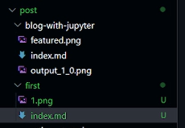{#fig:010 width=70%}

## Создание постов

Пост заполняется в формате Markdown. Ничего сложного - заголовки и немного картинок веселья ради.

## Создание постов

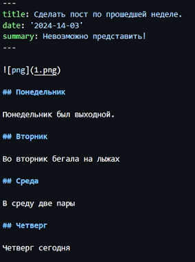{#fig:011 width=70%}

## Создание постов

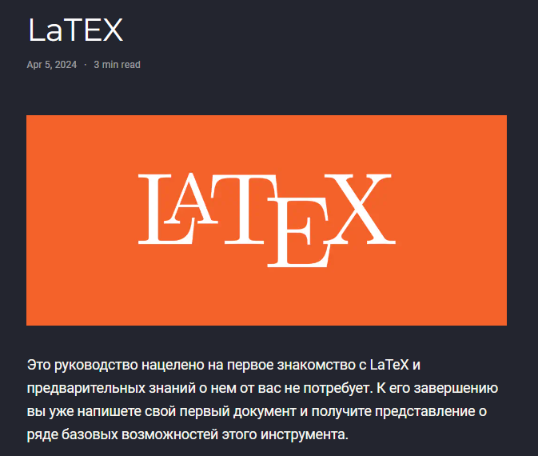{#fig:012 width=70%}

## Создание постов

Создадим также пост по заданной теме - язык разметки LaTEX. Соблюдаем те же шаги: создаем директорию поста, добавляем необходимые изображения и заполняем содержимое.

## Создание постов

{#fig:015 width=70%}

## Создание постов

Теперь, когда оба поста успешно созданы, можно увидеть их в общем списке постов на сайте:

## Создание постов

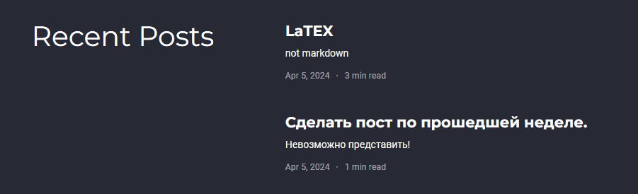{#fig:016 width=70%}

# Выводы

Получены навыки работы со списками, постами и изображениями в редакторе сайтов Hugo.
