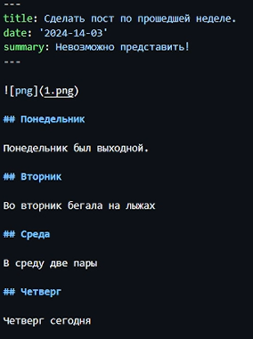

---
## Front matter
title: " Индивидуальный проект: этап 3"
subtitle: "Добавить к сайту достижения"
author: "Буллер Татьяна Александровна"

## Generic otions
lang: ru-RU
toc-title: "Содержание"

## Bibliography
bibliography: bib/cite.bib
csl: pandoc/csl/gost-r-7-0-5-2008-numeric.csl

## Pdf output format
toc: true # Table of contents
toc-depth: 2
lof: true # List of figures
lot: false # List of tables
fontsize: 12pt
linestretch: 1.5
papersize: a4
documentclass: scrreprt
## I18n polyglossia
polyglossia-lang:
  name: russian
  options:
	- spelling=modern
	- babelshorthands=true
polyglossia-otherlangs:
  name: english
## I18n babel
babel-lang: russian
babel-otherlangs: english
## Fonts
mainfont: PT Serif
romanfont: PT Serif
sansfont: PT Sans
monofont: PT Mono
mainfontoptions: Ligatures=TeX
romanfontoptions: Ligatures=TeX
sansfontoptions: Ligatures=TeX,Scale=MatchLowercase
monofontoptions: Scale=MatchLowercase,Scale=0.9
## Biblatex
biblatex: true
biblio-style: "gost-numeric"
biblatexoptions:
  - parentracker=true
  - backend=biber
  - hyperref=auto
  - language=auto
  - autolang=other*
  - citestyle=gost-numeric
## Pandoc-crossref LaTeX customization
figureTitle: "Рис."
tableTitle: "Таблица"
listingTitle: "Листинг"
lofTitle: "Список иллюстраций"
lotTitle: "Список таблиц"
lolTitle: "Листинги"
## Misc options
indent: true
header-includes:
  - \usepackage{indentfirst}
  - \usepackage{float} # keep figures where there are in the text
  - \floatplacement{figure}{H} # keep figures where there are in the text
---

# Цель работы

Получение навыков работы со списками, постами и изображениями в редакторе сайтов Hugo.

# Ход работы

## Добавление информации о навыках (Skills)

Редактируем элементы списка: заменяем под себя иконки (стандартный пакет иконок - font awesome (fas), но предусмотрены несколько других пакетов и возможность добавлять пользовательские файлы), названия навыков и процент заполнения шкалы. Присутствует так же возможность добавить описание.

{#fig:001 width=70%}

{#fig:002 width=70%}

## Добавление информации об опыте (Experience)

Опыт на сайте представлен в виде опыта работы. Его у меня нет, но есть невероятное множество прочих достижений. При заполнении опыта вновь работаем со списками, меняем под себя даты, иконки, места, названия и описание.

{#fig:003 width=70%}

{#fig:004 width=70%}

## Добавление информации о достижениях (Accomplishments)

Достижения - тоже список. Здесь также меняем даты, названия, придумываем пару цепляющих описаний и добавляем иконки. Также добавила ссылки на сайты компаний и организаций. В этот раздел можно также прикрепить сертификаты, но их у меня нет времени рисовать.

{#fig:005 width=70%}

{#fig:006 width=70%}

## Создание постов

Для создания постов переходим в директорию post. Обязательный элемент поста - индексный файл с шапкой, где должны быть указаны заголовок, дата и краткое описание содержания поста.

{#fig:009 width=70%}

Для того, чтобы добавить к посту изображения, их также необходимо добавить в директорию содержимого поста. Хочу добавить птичку - добавлю птичку.

{#fig:010 width=70%}

Пост заполняется в формате Markdown. Ничего сложного - заголовки и немного картинок веселья ради.

{#fig:011 width=70%}

{#fig:012 width=70%}

Создадим также пост по заданной теме - Непрерывная интеграция, поставка или развертывание. Соблюдаем те же шаги: создаем директорию поста, добавляем необходимые изображения и заполняем содержимое.

{#fig:015 width=70%}

Теперь, когда оба поста успешно созданы, можно увидеть их в общем списке постов на сайте:

{#fig:016 width=70%}

# Выводы

Получены навыки работы со списками, постами и изображениями в редакторе сайтов Hugo.
