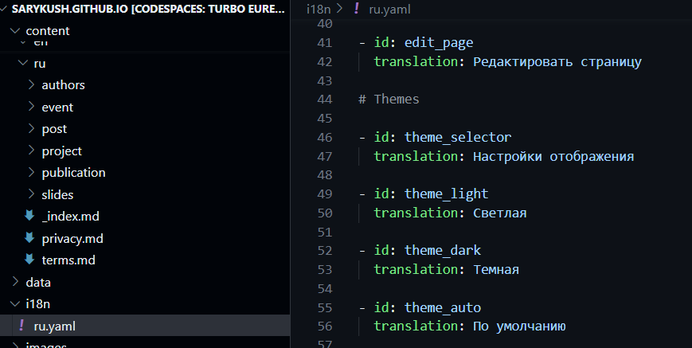
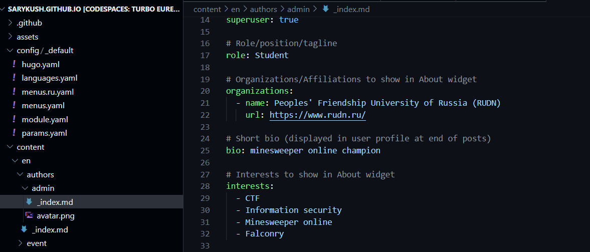
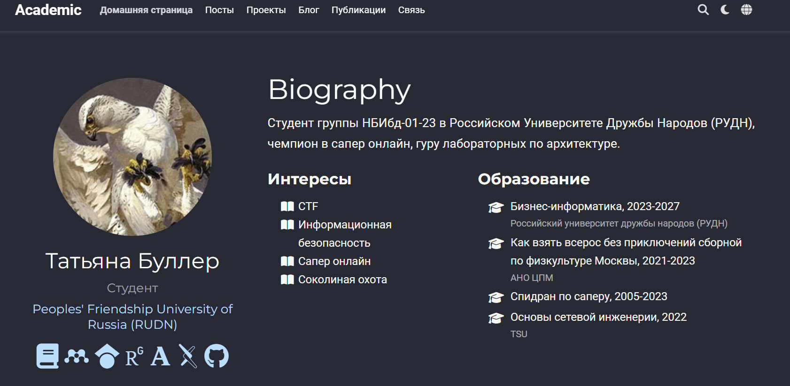
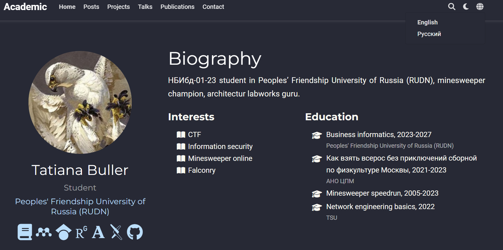
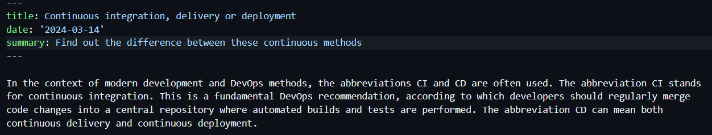
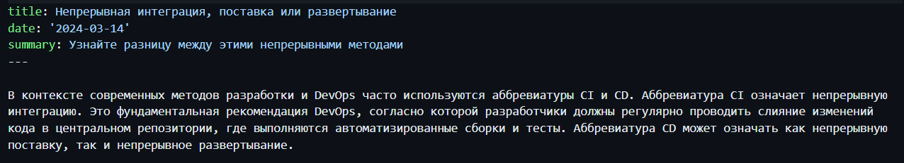
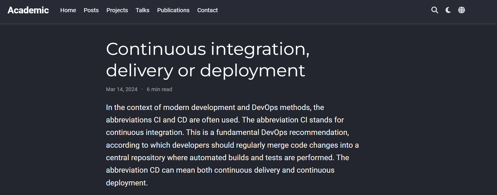
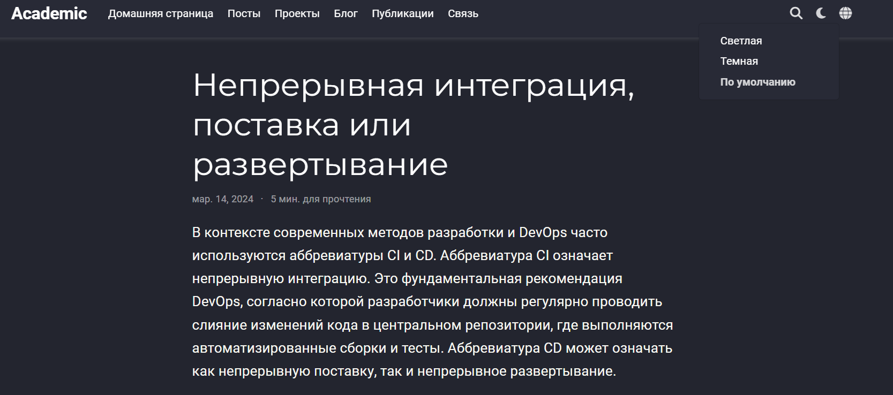

---
## Front matter
lang: ru-RU
title: Индивидуальный проект - этап 6
subtitle: Поддержка мультиязычности для сайта
author:
  - Буллер Т. А.
institute:
  - Российский университет дружбы народов, Москва, Россия
date: 23 мая 2024

## Formatting pdf
toc: false
toc-title: Содержание
slide_level: 2
aspectratio: 169
section-titles: true
theme: metropolis
header-includes:
 - \metroset{progressbar=frametitle,sectionpage=progressbar,numbering=fraction}
 - '\makeatletter'
 - '\beamer@ignorenonframefalse'
 - '\makeatother'
## I18n polyglossia
polyglossia-lang:
  name: russian
  options:
        - spelling=modern
        - babelshorthands=true
polyglossia-otherlangs:
  name: english
## I18n babel
babel-lang: russian
babel-otherlangs: english
## Fonts
mainfont: PT Serif
romanfont: PT Serif
sansfont: PT Sans
monofont: PT Mono
mainfontoptions: Ligatures=TeX
romanfontoptions: Ligatures=TeX
sansfontoptions: Ligatures=TeX,Scale=MatchLowercase
monofontoptions: Scale=MatchLowercase,Scale=0.9

---

# Информация

## Докладчик

:::::::::::::: {.columns align=center}
::: {.column width="70%"}

  * Буллер Татьяна Александровна
  * студент группы  НБИбд-01-23
  * Российский университет дружбы народов

:::
::: {.column width="30%"}

:::
::::::::::::::
# Вводная часть

## Объект и предмет исследования

- Процесс создания постов в Hugo
- Процесс редактирования данных и списков в Hugo

## Цели и задачи

- Получение навыков работы со списками, постами и изображениями в редакторе сайтов Hugo.

## Материалы и методы

- Редактор сайтов Hugo
- github codespace
- Процессор `pandoc` для входного формата Markdown
- Результирующие форматы
	- `pdf`
	- `html`
- Автоматизация процесса создания: `Makefile`

# Ход работы

## Поддержка двух и более языков

Добавление второго языка к сайту осуществим в несколько этапов. Во-первых, создадим в корне сайта директорию i18n, куда вставим шаблонный файл перевода основных конструкций (ru.yaml), предлагаемый самим Hugoblocks. Этот файл несовершенен: в нем некорректно переведены некоторые словосочетания, часть вовсе оставлена без перевода, поэтому отредактируем его, приведя к более приемлемому виду.

## Поддержка двух и более языков

{#fig:001 width=70%}

## Поддержка двух и более языков

Далее продублируем файл меню для нового введенного языка, назовем этот файл menus.ru.yaml, чтобы он связывался с прочими файлами языка. Там переведем основные ссылки меню на русский язык.

## Поддержка двух и более языков

{#fig:002 width=70%}

## Поддержка двух и более языков

Последним этапом редактируем директорию общего содержимого. То, что имелось в ней до этого, переместим в папку content/en/ (переведя на английский) и создадим дополнительную папку content/ru/, куда скопируем содержимое и переведем его на русский язык.

## Поддержка двух и более языков

{#fig:003 width=70%}

## Поддержка двух и более языков

На этом работа с переводом закончена - можем видеть ее итоги на сайте.

{#fig:004 width=70%}

## Поддержка двух и более языков

{#fig:005 width=70%}

## Создание постов

Для создания постов переходим в директорию post. Обязательный элемент поста - индексный файл с шапкой, где должны быть указаны заголовок, дата и краткое описание содержания поста.
Теперь необходимо создавать "зеркала" постов в соответствующих директориях: en/posts/post_name для постов на английском языке и ru/posts/post_name для постов на русском.
Пост заполняется в формате Markdown. Ничего сложного - заголовки и немного картинок веселья ради. 

## Создание постов

{#fig:006 width=70%}

## Создание постов

{#fig:007 width=70%}

## Создание постов

Теперь, если зайти на переведенный пост и сменить язык, пост будет переведен (точнее, отобразится содержимое этого поста, записанное в директории выбранного языка).

## Создание постов

{#fig:008 width=70%}

## Создание постов

{#fig:009 width=70%}

# Выводы

Получены навыки работы со списками, постами и изображениями в редакторе сайтов Hugo.

