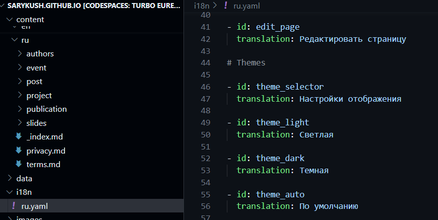
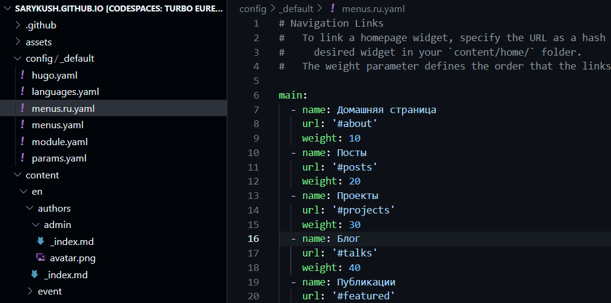
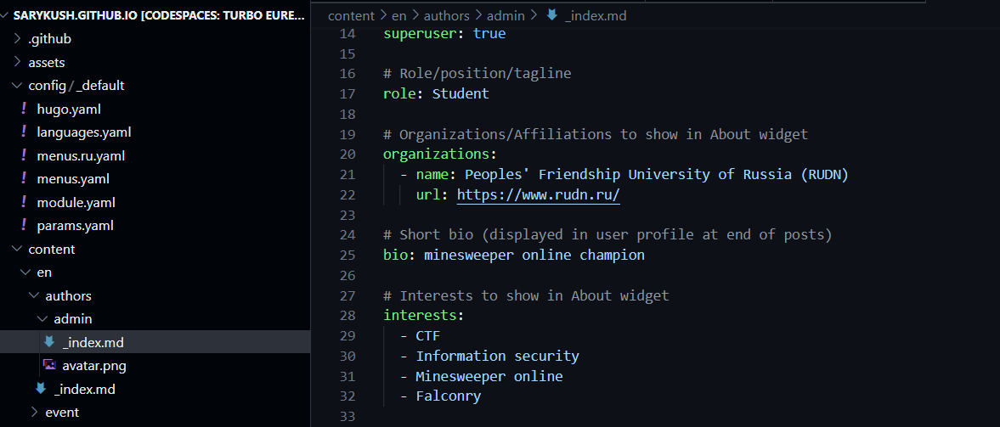
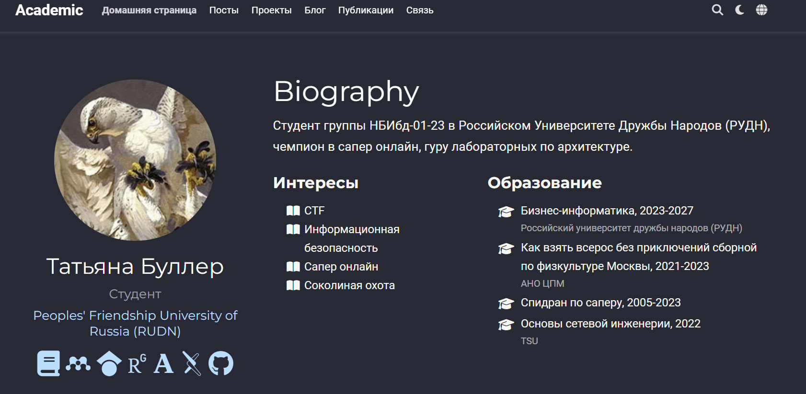
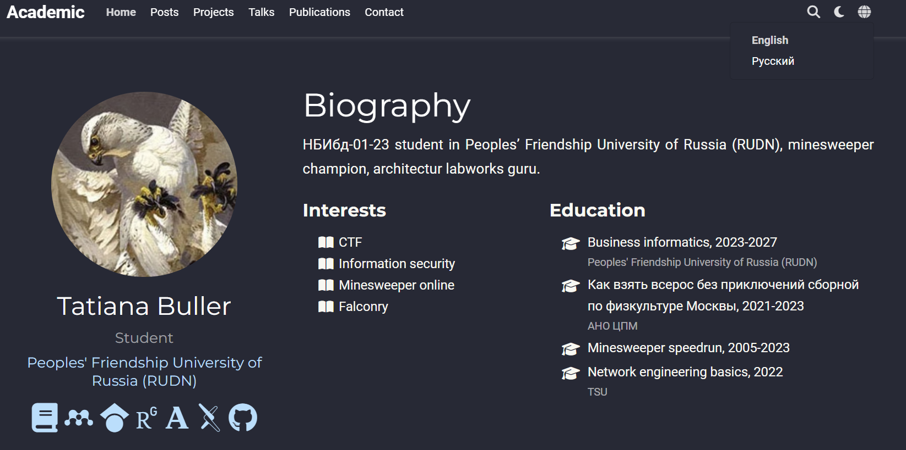
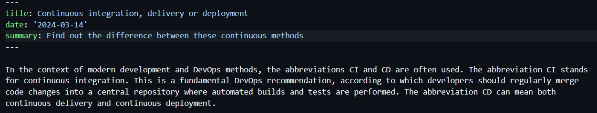
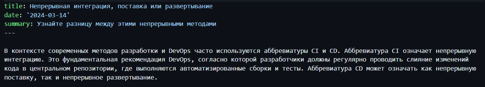
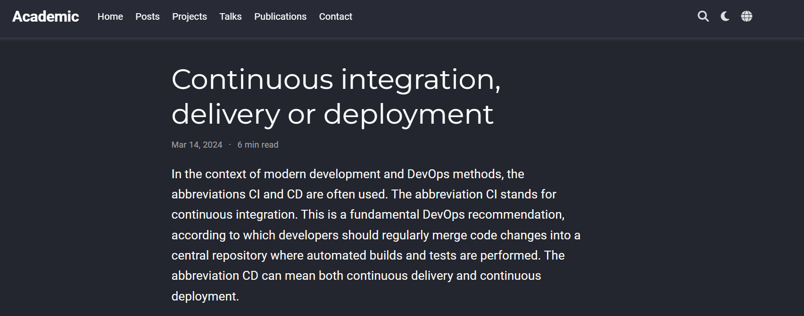
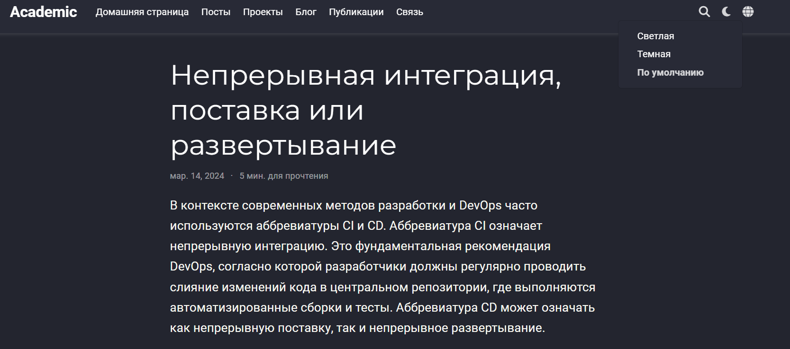

---
## Front matter
title: "Индивидуальный проект: этап 6"
subtitle: "Создание мультиязычного сайта"
author: "Буллер Татьяна Александровна"

## Generic otions
lang: ru-RU
toc-title: "Содержание"

## Bibliography
bibliography: bib/cite.bib
csl: pandoc/csl/gost-r-7-0-5-2008-numeric.csl

## Pdf output format
toc: true # Table of contents
toc-depth: 2
lof: true # List of figures
lot: false # List of tables
fontsize: 12pt
linestretch: 1.5
papersize: a4
documentclass: scrreprt
## I18n polyglossia
polyglossia-lang:
  name: russian
  options:
	- spelling=modern
	- babelshorthands=true
polyglossia-otherlangs:
  name: english
## I18n babel
babel-lang: russian
babel-otherlangs: english
## Fonts
mainfont: PT Serif
romanfont: PT Serif
sansfont: PT Sans
monofont: PT Mono
mainfontoptions: Ligatures=TeX
romanfontoptions: Ligatures=TeX
sansfontoptions: Ligatures=TeX,Scale=MatchLowercase
monofontoptions: Scale=MatchLowercase,Scale=0.9
## Biblatex
biblatex: true
biblio-style: "gost-numeric"
biblatexoptions:
  - parentracker=true
  - backend=biber
  - hyperref=auto
  - language=auto
  - autolang=other*
  - citestyle=gost-numeric
## Pandoc-crossref LaTeX customization
figureTitle: "Рис."
tableTitle: "Таблица"
listingTitle: "Листинг"
lofTitle: "Список иллюстраций"
lotTitle: "Список таблиц"
lolTitle: "Листинги"
## Misc options
indent: true
header-includes:
  - \usepackage{indentfirst}
  - \usepackage{float} # keep figures where there are in the text
  - \floatplacement{figure}{H} # keep figures where there are in the text
---

# Цель работы

Получение навыков работы со списками, постами и изображениями в редакторе сайтов Hugo.

# Ход работы

## Поддержка двух и более языков

Добавление второго языка к сайту осуществим в несколько этапов. Во-первых, создадим в корне сайта директорию i18n, куда вставим шаблонный файл перевода основных конструкций (ru.yaml), предлагаемый самим Hugoblocks. Этот файл несовершенен: в нем некорректно переведены некоторые словосочетания, часть вовсе оставлена без перевода, поэтому отредактируем его, приведя к более приемлемому виду.

{#fig:001 width=70%}

Далее продублируем файл меню для нового введенного языка, назовем этот файл menus.ru.yaml, чтобы он связывался с прочими файлами языка. Там переведем основные ссылки меню на русский язык.

{#fig:002 width=70%}

Последним этапом редактируем директорию общего содержимого. То, что имелось в ней до этого, переместим в папку content/en/ (переведя на английский) и создадим дополнительную папку content/ru/, куда скопируем содержимое и переведем его на русский язык.

{#fig:003 width=70%}

На этом работа с переводом закончена - можем видеть ее итоги на сайте.

{#fig:004 width=70%}

{#fig:005 width=70%}

## Создание постов

Для создания постов переходим в директорию post. Обязательный элемент поста - индексный файл с шапкой, где должны быть указаны заголовок, дата и краткое описание содержания поста.
Теперь необходимо создавать "зеркала" постов в соответствующих директориях: en/posts/post_name для постов на английском языке и ru/posts/post_name для постов на русском.
Пост заполняется в формате Markdown. Ничего сложного - заголовки и немного картинок веселья ради. 

{#fig:006 width=70%}

{#fig:007 width=70%}

Теперь, если зайти на переведенный пост и сменить язык, пост будет переведен (точнее, отобразится содержимое этого поста, записанное в директории выбранного языка).

{#fig:008 width=70%}

{#fig:009 width=70%}

# Выводы

Получены навыки работы со списками, постами и изображениями в редакторе сайтов Hugo.
